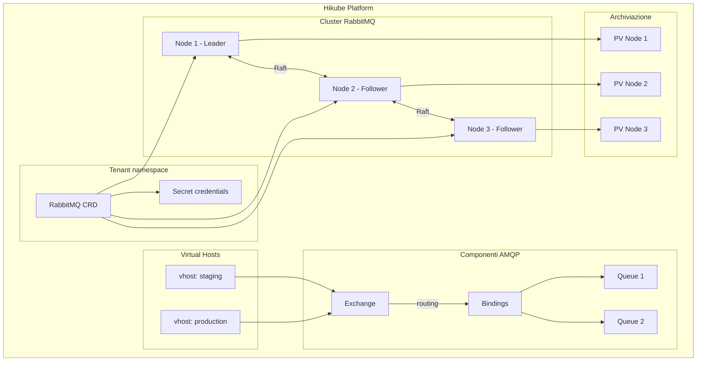
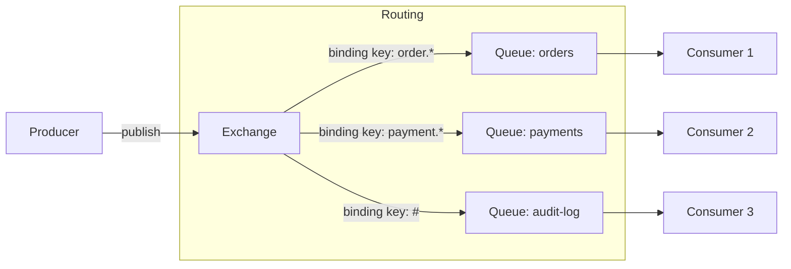
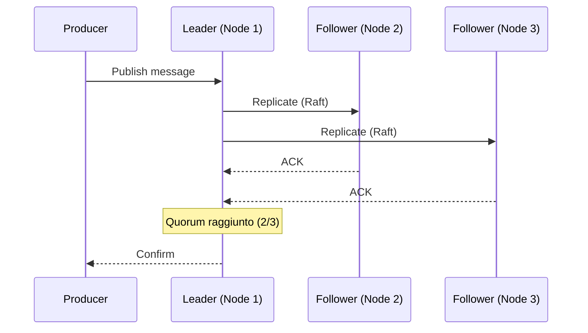

# Concetti — RabbitMQ

## Architettura

RabbitMQ su Hikube è un servizio di messaggistica gestito basato sul protocollo **AMQP**. Ogni istanza distribuita tramite la risorsa `RabbitMQ` crea un cluster ad alta disponibilità con **quorum queue** (protocollo Raft) per la replica dei messaggi.

---

## Terminologia

| Termine | Descrizione |
|---------|-------------|
| **RabbitMQ** | Risorsa Kubernetes (`apps.cozystack.io/v1alpha1`) che rappresenta un cluster RabbitMQ gestito. |
| **AMQP** | Advanced Message Queuing Protocol — protocollo standard di messaggistica supportato da RabbitMQ. |
| **Exchange** | Punto di ingresso dei messaggi. Instrada i messaggi verso le code tramite binding. |
| **Queue** | Coda che archivia i messaggi in attesa che un consumer li elabori. |
| **Binding** | Regola di routing tra un exchange e una coda (basata su una routing key). |
| **Quorum Queue** | Tipo di coda che utilizza il protocollo **Raft** per replicare i messaggi su più nodi. |
| **Virtual Host (vhost)** | Spazio dei nomi logico che isola exchange, code e permessi all'interno di uno stesso cluster. |
| **Consumer** | Applicazione che legge ed elabora i messaggi di una coda. |
| **resourcesPreset** | Profilo di risorse predefinito (da nano a 2xlarge). |

---

## Routing dei messaggi

RabbitMQ utilizza un modello di routing flessibile basato sugli exchange e i binding:

### Tipi di exchange

| Tipo | Routing |
|------|---------|
| **direct** | Routing key esatta |
| **topic** | Pattern matching con wildcard (`*`, `#`) |
| **fanout** | Broadcast a tutte le code collegate |
| **headers** | Routing basato sugli header del messaggio |

---

## Quorum Queue e alta disponibilità

Le quorum queue utilizzano il protocollo **Raft** per replicare i messaggi:

1. Un nodo viene eletto **leader** per ogni coda
2. I messaggi vengono replicati sui **follower** prima della conferma
3. In caso di guasto del leader, un follower viene automaticamente promosso

:::tip
Configurate `replicas: 3` minimo per garantire il quorum Raft e l'alta disponibilità delle quorum queue.
:::

---

## Virtual Host

I **vhost** isolano le risorse all'interno di uno stesso cluster:

- Ogni vhost ha i propri exchange, code e permessi
- Gli utenti possono avere ruoli diversi per vhost: `admin` o `readonly`
- Utile per separare gli ambienti (produzione, staging) sullo stesso cluster

---

## Gestione degli utenti

Gli utenti sono dichiarati nel manifesto con:

- **Password** per l'autenticazione
- **Ruoli per vhost**: `admin` (lettura/scrittura/configurazione), `readonly` (sola lettura)

Le credenziali sono archiviate nel Secret `<istanza>-credentials`.

---

## Preset di risorse

| Preset | CPU | Memoria |
|--------|-----|---------|
| `nano` | 250m | 128Mi |
| `micro` | 500m | 256Mi |
| `small` | 1 | 512Mi |
| `medium` | 1 | 1Gi |
| `large` | 2 | 2Gi |
| `xlarge` | 4 | 4Gi |
| `2xlarge` | 8 | 8Gi |

---

## Limiti e quote

| Parametro | Valore |
|-----------|--------|
| Repliche max | Secondo la quota del tenant |
| Dimensione archiviazione (`size`) | Variabile (in Gi) |
| Vhost per cluster | Illimitato (secondo le risorse) |
| Protocolli supportati | AMQP 0-9-1, AMQP 1.0, MQTT, STOMP |

---

## Per approfondire

- [Panoramica](./overview.md): presentazione del servizio
- [Riferimento API](./api-reference.md): tutti i parametri della risorsa RabbitMQ
