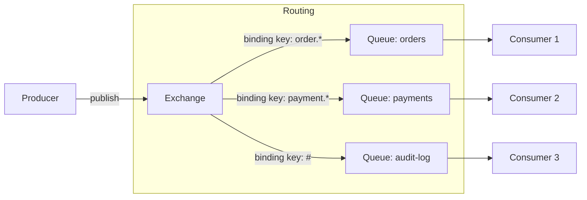
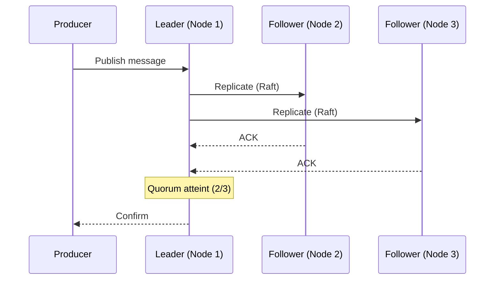

# Concepts — RabbitMQ

## Architettura

RabbitMQ sur Hikube est un service de messaging managé basé sur le protocole **AMQP**. Chaque instance déployée via la ressource `RabbitMQ` crée un cluster haute disponibilité avec des **quorum queues** (protocole Raft) pour la réplication des messages.

---

## Terminologia

| Terme | Description |
|-------|-------------|
| **RabbitMQ** | Ressource Kubernetes (`apps.cozystack.io/v1alpha1`) représentant un cluster RabbitMQ managé. |
| **AMQP** | Advanced Message Queuing Protocol — protocole standard de messaging supporté par RabbitMQ. |
| **Exchange** | Point d'entrée des messages. Route les messages vers les queues via des bindings. |
| **Queue** | File d'attente qui stocke les messages en attendant qu'un consumer les traite. |
| **Binding** | Règle de routage entre un exchange et une queue (basée sur une routing key). |
| **Quorum Queue** | Type de queue utilisant le protocole **Raft** pour répliquer les messages sur plusieurs nœuds. |
| **Virtual Host (vhost)** | Espace de noms logique qui isole les exchanges, queues et permissions au sein d'un même cluster. |
| **Consumer** | Application qui lit et traite les messages d'une queue. |
| **resourcesPreset** | Profil de ressources prédéfini (nano à 2xlarge). |

---

## Routage des messages

RabbitMQ utilise un modèle de routage flexible basé sur les exchanges et les bindings :

### Types d'exchanges

| Type | Routage |
|------|---------|
| **direct** | Routing key exacte |
| **topic** | Pattern matching avec wildcards (`*`, `#`) |
| **fanout** | Broadcast à toutes les queues liées |
| **headers** | Routage basé sur les headers du message |

---

## Quorum Queues et haute disponibilité

Les quorum queues utilisent le protocole **Raft** pour répliquer les messages :

1. Un nœud est élu **leader** pour chaque queue
2. Les messages sont répliqués sur les **followers** avant confirmation
3. En cas de panne du leader, un follower est automatiquement promu

:::tip
Configurez `replicas: 3` minimum pour garantir le quorum Raft et la haute disponibilité des quorum queues.
:::

---

## Virtual Hosts

Les **vhosts** isolent les ressources au sein d'un même cluster :

- Chaque vhost a ses propres exchanges, queues et permissions
- Les utilisateurs peuvent avoir des rôles différents par vhost : `admin` ou `readonly`
- Utile pour séparer les environnements (production, staging) sur un même cluster

---

## Gestion des utilisateurs

Les utilisateurs sont déclarés dans le manifeste avec :

- **Mot de passe** pour l'authentification
- **Rôles par vhost** : `admin` (lecture/écriture/configuration), `readonly` (lecture seule)

Les credentials sont stockés dans le Secret `<instance>-credentials`.

---

## Presets de ressources

| Preset | CPU | Mémoire |
|--------|-----|---------|
| `nano` | 250m | 128Mi |
| `micro` | 500m | 256Mi |
| `small` | 1 | 512Mi |
| `medium` | 1 | 1Gi |
| `large` | 2 | 2Gi |
| `xlarge` | 4 | 4Gi |
| `2xlarge` | 8 | 8Gi |

---

## Limites et quotas

| Paramètre | Valeur |
|-----------|--------|
| Réplicas max | Selon quota tenant |
| Taille stockage (`size`) | Variable (en Gi) |
| Vhosts par cluster | Illimité (selon ressources) |
| Protocoles supportés | AMQP 0-9-1, AMQP 1.0, MQTT, STOMP |

---

## Per approfondire

- [Overview](./overview.md) : présentation du service
- [Référence API](./api-reference.md) : tous les paramètres de la ressource RabbitMQ
