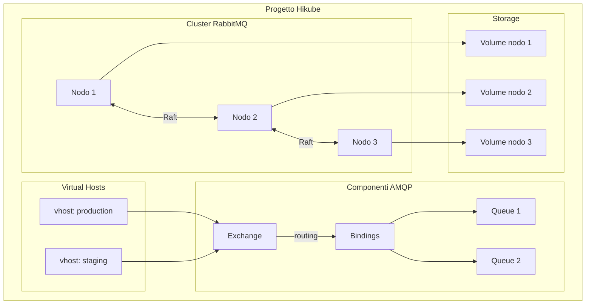
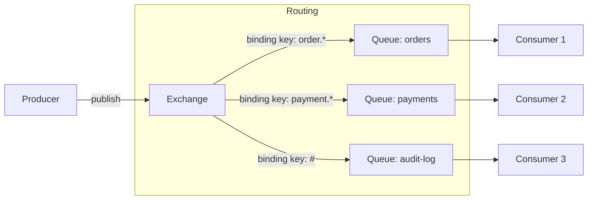
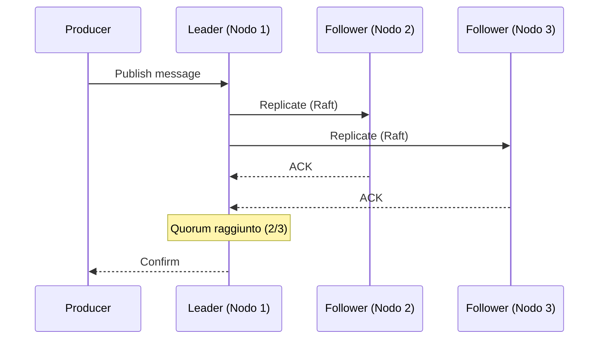

# Concetti — RabbitMQ

## Architettura

RabbitMQ su Hikube è un servizio di messaggistica gestito basato sul protocollo **AMQP**. Ogni cluster creato dalla [console Hikube](https://console.hikube.cloud) appartiene a un **progetto** e consuma le quote di tale progetto (CPU, memoria, storage).

```mermaid
graph TB
    subgraph "Progetto Hikube"
        subgraph "Cluster RabbitMQ"
            N1[Nodo 1]
            N2[Nodo 2]
            N3[Nodo 3]
        end

        subgraph "Virtual Hosts"
            VH1[vhost: production]
            VH2[vhost: staging]
        end

        subgraph "Componenti AMQP"
            EX[Exchange]
            Q1[Queue 1]
            Q2[Queue 2]
            B[Bindings]
        end

        subgraph "Storage"
            PV1[Volume nodo 1]
            PV2[Volume nodo 2]
            PV3[Volume nodo 3]
        end
    end

    N1 <-->|Raft| N2
    N2 <-->|Raft| N3
    N1 --> PV1
    N2 --> PV2
    N3 --> PV3
    VH1 --> EX
    VH2 --> EX
    EX -->|routing| B
    B --> Q1
    B --> Q2
```

---

## Terminologia

| Termine | Descrizione |
|---------|-------------|
| **Cluster RabbitMQ** | Istanza RabbitMQ gestita, creata e amministrata dalla console (menu **DB & Messaging** → **RabbitMQ**). |
| **AMQP** | Advanced Message Queuing Protocol, protocollo standard di messaggistica supportato da RabbitMQ. |
| **Exchange** | Punto di ingresso dei messaggi. Instrada i messaggi verso le queue tramite i binding. |
| **Queue** | Coda che conserva i messaggi in attesa che un consumer li elabori. |
| **Binding** | Regola di instradamento tra un exchange e una queue (basata su una routing key). |
| **Quorum Queue** | Tipo di queue che utilizza il protocollo **Raft** per replicare i messaggi su più nodi. |
| **Virtual Host (vhost)** | Spazio dei nomi logico che isola exchange, queue e permessi all'interno di uno stesso cluster. |
| **Consumer** | Applicazione che legge ed elabora i messaggi di una queue. |
| **Preset** | Profilo di risorse CPU/memoria predefinito, scelto alla creazione del cluster. |
| **Repliche** | Numero di nodi RabbitMQ del cluster. Determina la modalità di deployment. |

---

## Modalità di deployment

Il campo **Number of replicas** della procedura guidata propone tre valori:

| Valore | Etichetta nella console | Modalità |
|--------|-------------------------|----------|
| 1 | **1 (Standalone)** | Un solo nodo. Il volume dei dati è replicato a livello dello storage della piattaforma. |
| 3 | **3 (Max High Availability)** | Cluster di 3 nodi. La replica dei messaggi è assicurata da RabbitMQ (quorum queues). |
| 5 | **5 (Ultra High Availability)** | Cluster di 5 nodi, tollerante alla perdita di due nodi. |

:::warning Modalità fissata alla creazione
La modalità (standalone o cluster) e il numero di repliche non possono essere modificati dopo la creazione: la console mostra « The mode cannot be changed after creation ». Per cambiare modalità, crei un nuovo cluster.
:::

---

## Instradamento dei messaggi

RabbitMQ utilizza un modello di instradamento flessibile basato su exchange e binding:

```mermaid
graph LR
    P[Producer] -->|publish| EX[Exchange]

    subgraph "Routing"
        EX -->|binding key: order.*| Q1[Queue: orders]
        EX -->|binding key: payment.*| Q2[Queue: payments]
        EX -->|binding key: #| Q3[Queue: audit-log]
    end

    Q1 --> C1[Consumer 1]
    Q2 --> C2[Consumer 2]
    Q3 --> C3[Consumer 3]
```

### Tipi di exchange

| Tipo | Instradamento |
|------|---------------|
| **direct** | Routing key esatta |
| **topic** | Pattern matching con caratteri jolly (`*`, `#`) |
| **fanout** | Broadcast a tutte le queue collegate |
| **headers** | Instradamento basato sugli header del messaggio |

Exchange, queue e binding vengono creati dalle sue applicazioni, con un client AMQP connesso al vhost desiderato. La console gestisce il cluster, i vhost e gli utenti, non gli oggetti AMQP stessi.

---

## Quorum queues e alta disponibilità

Le quorum queues utilizzano il protocollo **Raft** per replicare i messaggi:

1. Per ogni queue viene eletto un nodo **leader**
2. I messaggi vengono replicati sui **followers** prima della conferma
3. In caso di guasto del leader, un follower viene promosso automaticamente

```mermaid
sequenceDiagram
    participant P as Producer
    participant L as Leader (Nodo 1)
    participant F1 as Follower (Nodo 2)
    participant F2 as Follower (Nodo 3)

    P->>L: Publish message
    L->>F1: Replicate (Raft)
    L->>F2: Replicate (Raft)
    F1-->>L: ACK
    F2-->>L: ACK
    Note over L: Quorum raggiunto (2/3)
    L-->>P: Confirm
```

:::tip
Scelga **3 (Max High Availability)** o **5 (Ultra High Availability)** repliche per garantire il quorum Raft, e dichiari le queue critiche come quorum queues (argomento `x-queue-type: quorum` lato client).
:::

---

## Virtual host

I **vhost** isolano le risorse all'interno di uno stesso cluster:

- Ogni vhost ha i propri exchange, queue e permessi
- Un utente può avere un diritto diverso su ciascun vhost
- Utile per separare gli ambienti (production, staging) o le applicazioni su uno stesso cluster

La procedura guidata di creazione richiede almeno un vhost. Altri vhost possono essere aggiunti in seguito dalla pagina del cluster (pulsante **Add a VHost**).

---

## Utenti e diritti

Ogni utente RabbitMQ riceve una **password generata dalla piattaforma**, mostrata **una sola volta** alla creazione (o dopo una rotazione). I suoi diritti sono definiti **per vhost**:

| Diritto nella console | Effetto |
|-----------------------|---------|
| **Administrator** | Lettura, scrittura e configurazione sul vhost |
| **Read-only** | Sola lettura sul vhost |
| **No access** | L'utente non ha accesso al vhost |

Un utente può avere un solo diritto per vhost. I diritti si modificano in qualsiasi momento con l'azione **Manage Access**.

---

## Preset di risorse

Il **Preset** fissa le risorse CPU e memoria di ciascun nodo. La console mostra i valori di ogni preset nell'elenco a discesa.

| Preset | CPU | Memoria |
|--------|-----|---------|
| **Micro** | 0,5 | 256 Mi |
| **Small** | 1 | 512 Mi |
| **Medium** | 1 | 1 Gi |
| **Large** | 2 | 2 Gi |
| **X-Large** | 4 | 4 Gi |
| **2X-Large** | 8 | 8 Gi |

Il preset **Small** è selezionato per impostazione predefinita. **Non può essere modificato dopo la creazione**.

---

## Limiti

| Parametro | Valore |
|-----------|--------|
| Nome del cluster | Da 3 a 16 caratteri: lettere minuscole, cifre e trattini; inizia con una lettera e termina con una lettera o una cifra |
| Versioni disponibili | 4.2, 4.1, 4.0, 3.13 |
| Repliche | 1, 3 o 5 (fissate alla creazione) |
| Dimensione del disco | Da 1 a 4096 GB per nodo, entro il limite della quota di storage del progetto; solo aumento |
| Accesso esterno | Attivabile alla creazione o in seguito |
| Porta AMQP | 5672, senza TLS |

---

## Per approfondire

- [Panoramica](./overview.md): presentazione del servizio
- [Avvio rapido](./quick-start.md): creare il primo cluster
- [Gestire vhost e utenti](./how-to/manage-vhosts-users.md)
