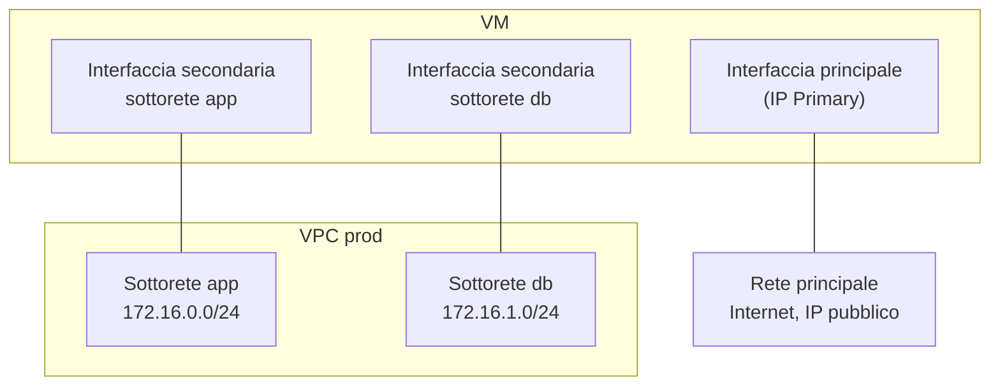

# Concetti — Rete

## Architettura

Ogni VM Hikube dispone di una **rete principale**, gestita dalla piattaforma: è attraverso di essa che passano l'accesso a Internet e, se attivato, l'IP pubblico. I **VPC** aggiungono reti private **secondarie**: ogni sottorete a cui una VM è collegata le fornisce un'interfaccia di rete aggiuntiva.

I VPC si basano su una rete definita via software: ogni VPC è un router virtuale isolato, ogni sottorete uno switch virtuale.

---

## Terminologia

| Termine | Descrizione |
|-------|-------------|
| **VPC** | Rete privata isolata del progetto. Non ha un proprio intervallo di indirizzi: sono le sue sottoreti a definirne uno. |
| **Sottorete** | Intervallo di indirizzi IPv4 privato (blocco CIDR) all'interno di un VPC. Una VM si collega a una o più sottoreti. |
| **Blocco CIDR** | Notazione di un intervallo di indirizzi, ad esempio `172.16.0.0/24` (256 indirizzi, da `172.16.0.0` a `172.16.0.255`). |
| **Rete principale** | Rete predefinita di ogni VM, con il gateway predefinito e l'eventuale IP pubblico. Mostrata come indirizzo **Primary** nella pagina di dettaglio della VM. |
| **Interfaccia secondaria** | Interfaccia di rete aggiunta alla VM per ogni sottorete collegata. I suoi indirizzi compaiono come **Secondary**. |

---

## Regole di denominazione

| Elemento | Regola |
|---------|-------|
| **VPC Name** | Da 3 a 16 caratteri: lettere minuscole, cifre e trattini; deve iniziare con una lettera e terminare con una lettera o una cifra. Univoco nel progetto. |
| **Subnet Name** | Da 1 a 63 caratteri: lettere minuscole, cifre e trattini. Univoco nel VPC. |

---

## Intervalli di indirizzi

Una sottorete deve utilizzare un intervallo **IPv4 privato** (RFC 1918):

| Intervallo consentito | Esempio di sottorete |
|-----------------|------------------------|
| `10.0.0.0/8` | `10.10.0.0/24` |
| `172.16.0.0/12` | `172.16.0.0/24` (valore proposto per impostazione predefinita) |
| `192.168.0.0/16` | `192.168.10.0/24` |

Vincoli verificati alla creazione:

- due sottoreti di uno **stesso** VPC non possono sovrapporsi;
- una sottorete non può sovrapporsi agli intervalli riservati dalla piattaforma `10.244.0.0/16` e `10.96.0.0/12`;
- due VPC **diversi** possono utilizzare gli stessi intervalli, poiché sono isolati.

:::tip Raccomandazione
Utilizzi sottoinsiemi di `172.16.0.0/12`, ad esempio un `/24` per sottorete (`172.16.0.0/24`, `172.16.1.0/24`…). In questo modo evita gli intervalli riservati in `10.x`.
:::

---

## Isolamento

- Un VPC appartiene a un progetto; è visibile solo in questo progetto.
- Due VPC sono isolati l'uno dall'altro. Per far transitare flussi tra due VPC, colleghi una VM a entrambi e vi configuri il routing nel sistema operativo.
- Un VPC non ha un proprio accesso a Internet: il traffico Internet della VM passa per la sua rete principale.

---

## Ciclo di vita

| Azione | Comportamento |
|--------|--------------|
| **Create VPC** | Procedura guidata in tre passaggi: **General** (nome), **Subnets** (almeno una, fino a dieci), **Review**. |
| Aggiungere una sottorete | **View Subnets** > **Create Subnet**, oppure dalla procedura guidata VM. |
| Eliminare una sottorete | Rifiutato finché una VM vi è collegata (**Cannot delete**, con l'elenco delle VM). |
| Eliminare un VPC | Elimina anche tutte le sue sottoreti. Rifiutato finché una VM vi è collegata. |
| Modificare un VPC o una sottorete | Non disponibile: ne crei uno nuovo. |

Stato di un VPC nell'elenco: **Provisioning** durante la sua predisposizione, poi **Ready** quando è utilizzabile.

---

## Per approfondire

- [Panoramica](./overview.md)
- [Avvio rapido](./quick-start.md)
- [Concetti delle macchine virtuali](../compute/concepts.md)
