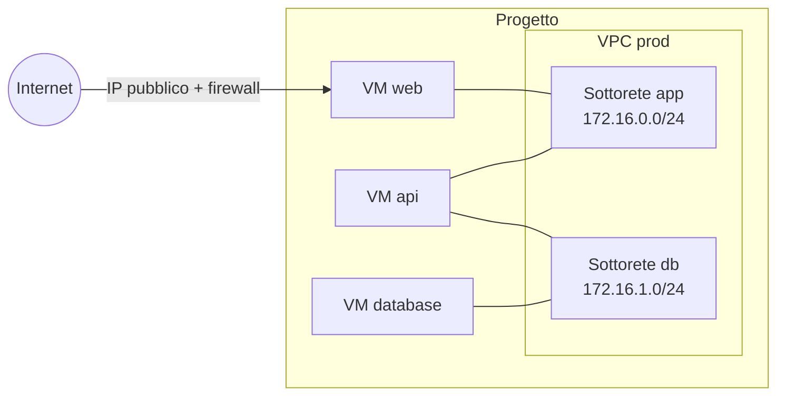

import NavigationFooter from '@site/src/components/NavigationFooter';

# Reti private su Hikube

Un **VPC** (*Virtual Private Cloud*) è una rete virtuale isolata, propria del suo progetto. È composto da una o più **sottoreti**, ciascuna con un intervallo di indirizzi IPv4 privato. Una VM collegata a una sottorete riceve un'interfaccia di rete aggiuntiva e un indirizzo in questo intervallo: può quindi raggiungere in privato le altre VM della stessa sottorete.

Nella [console Hikube](https://console.hikube.cloud), i VPC si gestiscono dal menu **Infrastructure** > **Networking** (pagina **Virtual Private Clouds**).

---

## Cosa può fare dalla console

| Esigenza | Dove farlo |
|--------|-------------|
| Creare un VPC e le sue prime sottoreti | **Networking** > **Create VPC** |
| Consultare e aggiungere sottoreti | Menu **Actions** di un VPC > **View Subnets** > **Create Subnet** |
| Collegare una VM a un VPC | Procedura guidata VM, passaggio **Network**, sezione **VPC Networks (Secondary)**; oppure **Edit** su una VM esistente |
| Creare un VPC o una sottorete senza lasciare la procedura guidata VM | Pulsante **+ VPC** e **Add subnet** della sezione **VPC Networks (Secondary)** |
| Eliminare una sottorete o un VPC | Menu **Actions** > **Delete** (rifiutato finché delle VM lo utilizzano) |

---

## Come si combinano

- Ogni VM mantiene la sua **rete principale** (quella dell'IP pubblico e dell'accesso a Internet). Le sottoreti VPC si aggiungono come interfacce **secondarie**.
- Una VM può essere collegata a più sottoreti, anche di VPC diversi.
- Un VPC non è esposto su Internet: l'accesso in ingresso dall'esterno passa per l'**IP pubblico** e il **firewall** della VM (vedere [Configurare la rete di una VM](../compute/how-to/configure-network.md)).

---

## Casi d'uso

- **Architettura multi-tier**: solo la VM di front-end ha un IP pubblico; le VM applicative e di database comunicano solo in privato.
- **Bastion**: una VM di amministrazione esposta in SSH, che fa da ponte verso VM senza IP pubblico.
- **Segmentazione**: separare i flussi per ambiente o per funzione, con una sottorete per ruolo.

---

## Limiti

- I VPC riguardano le **istanze VM**. I cluster Kubernetes e i database gestiti non vi si collegano dalla console.
- Un VPC non si rinomina e non si modifica: vi si aggiungono o vi si eliminano sottoreti.
- L'interconnessione di due VPC (*peering*) e le route statiche non sono disponibili nella console; contatti il [supporto](mailto:support@hidora.io).

---

## Passi successivi

- [Concetti](./concepts.md)
- [Avvio rapido](./quick-start.md)
- [Collegare una VM esistente a un VPC](./how-to/attach-vm-to-vpc.md)

<NavigationFooter
  nextSteps={[
    {label: "Concetti", href: "../concepts"},
    {label: "Avvio rapido", href: "../quick-start"},
  ]}
  seeAlso={[
    {label: "Risorse di calcolo", href: "../../compute/"},
  ]}
/>
