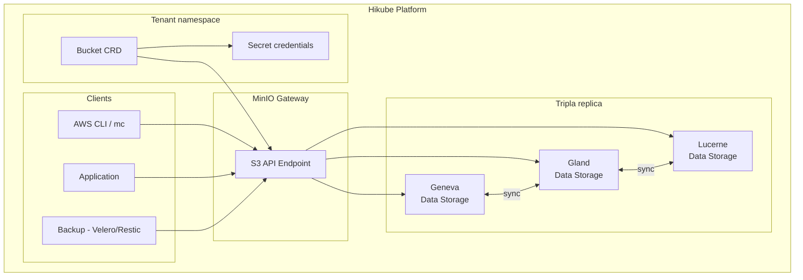

# Concetti — Bucket S3

## Architettura

Il servizio Object Storage di Hikube si basa su **MinIO**, una soluzione di archiviazione oggetti compatibile S3. I dati sono **triple-replicati** automaticamente su 3 datacenter geograficamente distinti, garantendo un'alta disponibilità anche in caso di perdita completa di un datacenter.



---

## Terminologia

| Termine | Descrizione |
|---------|-------------|
| **Bucket** | Risorsa Kubernetes (`apps.cozystack.io/v1alpha1`) che rappresenta un bucket S3. Un solo campo richiesto: il `name`. |
| **Object Storage** | Archiviazione non strutturata basata su oggetti (file) identificati da una chiave unica. |
| **S3-compatible** | API compatibile con il protocollo Amazon S3, supportata dalla maggior parte degli strumenti e degli SDK. |
| **MinIO** | Server di archiviazione oggetti open source, compatibile S3, utilizzato come backend da Hikube. |
| **Access Key / Secret Key** | Coppia di credenziali per l'autenticazione S3, generata automaticamente in un Secret Kubernetes. |
| **BucketInfo** | Campo JSON nel Secret contenente l'endpoint S3, il protocollo e la porta. |
| **Endpoint** | URL del servizio S3 Hikube: `https://prod.s3.hikube.cloud` |

---

## Funzionamento

### Creazione

La creazione di un bucket è la più semplice di tutte le risorse Hikube:

```yaml title="bucket.yaml"
apiVersion: apps.cozystack.io/v1alpha1
kind: Bucket
metadata:
  name: my-data
spec: {}
```

L'operatore crea automaticamente:
1. Il **bucket** in MinIO
2. Un **Secret Kubernetes** contenente le credenziali di accesso

### Credenziali automatiche

Il Secret `<bucket-name>-credentials` contiene:

| Chiave | Descrizione |
|--------|-------------|
| `accessKeyID` | Chiave di accesso S3 |
| `accessSecretKey` | Chiave segreta S3 |
| `bucketInfo` | JSON con endpoint, protocollo e porta |

---

## Tripla replica multi-datacenter

I dati sono automaticamente replicati su **3 datacenter**:

| Datacenter | Localizzazione |
|-----------|----------------|
| Region 1 | Geneva (Ginevra) |
| Region 2 | Gland |
| Region 3 | Lucerne |

Questa architettura garantisce:
- **Zero perdita di dati** in caso di guasto di un datacenter
- **Continuità di servizio** con failover automatico
- **Latenza ottimizzata** dalla Svizzera e dall'Europa

:::tip
La tripla replica è trasparente — non avete nulla da configurare. Tutti i dati sono automaticamente replicati.
:::

---

## Strumenti compatibili

Il servizio è compatibile con tutti gli strumenti che supportano il protocollo S3:

| Strumento | Caso d'uso |
|-----------|------------|
| **AWS CLI** | Gestione di file da riga di comando |
| **MinIO Client (mc)** | Client nativo MinIO |
| **rclone** | Sincronizzazione e migrazione di dati |
| **s3cmd** | Gestione S3 alternativa |
| **Velero** | Backup di cluster Kubernetes |
| **Restic** | Backup di database (PostgreSQL, MySQL, ClickHouse) |
| **SDK** | boto3 (Python), AWS SDK (Go, Java, Node.js) |

---

## Casi d'uso

| Caso d'uso | Descrizione |
|------------|-------------|
| **Archiviazione di asset** | Immagini, video, file statici per applicazioni web |
| **Backup** | Destinazione per i backup di database e cluster K8s |
| **Data lake** | Archiviazione di dati grezzi per l'analisi |
| **Archiviazione** | Conservazione a lungo termine di documenti e log |

---

## Limiti e quote

| Parametro | Valore |
|-----------|--------|
| Dimensione max per oggetto | Secondo configurazione MinIO |
| Numero di bucket | Secondo la quota del tenant |
| Replica | Tripla (3 DC), automatica |
| Endpoint | `https://prod.s3.hikube.cloud` |

---

## Per approfondire

- [Panoramica](./overview.md): presentazione dettagliata del servizio
- [Riferimento API](./api-reference.md): parametri della risorsa Bucket
