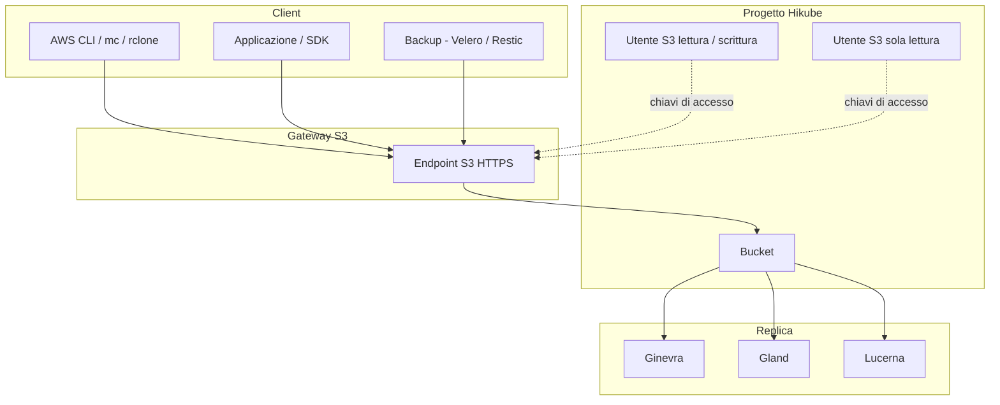

# Concetti — Bucket S3

## Architettura

Il servizio Object Storage di Hikube è compatibile S3. I dati sono **replicati** automaticamente su 3 datacenter geograficamente distinti, il che mantiene la disponibilità anche in caso di perdita completa di un datacenter.

```mermaid
graph TB
    subgraph "Progetto Hikube"
        BK[Bucket]
        U1[Utente S3 lettura / scrittura]
        U2[Utente S3 sola lettura]
    end

    subgraph "Gateway S3"
        GW[Endpoint S3 HTTPS]
    end

    subgraph "Replica"
        DC1[Ginevra]
        DC2[Gland]
        DC3[Lucerna]
    end

    subgraph "Client"
        CLI[AWS CLI / mc / rclone]
        APP[Applicazione / SDK]
        BKP[Backup - Velero / Restic]
    end

    U1 -.->|chiavi di accesso| GW
    U2 -.->|chiavi di accesso| GW
    CLI --> GW
    APP --> GW
    BKP --> GW
    GW --> BK
    BK --> DC1
    BK --> DC2
    BK --> DC3
```

---

## Terminologia

| Termine | Descrizione |
|-------|-------------|
| **Bucket** | Spazio di storage a oggetti creato dalla console (menu **Infrastructure** → **S3 Buckets**). |
| **Nome del bucket (console)** | Nome scelto alla creazione. Identifica il bucket nella console e non può essere modificato. |
| **S3 Bucket Name** | Nome effettivo del bucket lato S3, generato dalla piattaforma. È **questo nome** che i suoi client S3 devono utilizzare. È visualizzato nella pagina del bucket. |
| **S3 Endpoint** | Indirizzo del servizio S3 (ad esempio `prod.s3.hikube.cloud`), visualizzato nella pagina del bucket. |
| **Utente S3** | Identità associata a un bucket, con un diritto **Read-only** o **Read / Write**. Un bucket può avere più utenti. |
| **Access Key ID / Secret Access Key** | Coppia di chiavi di autenticazione S3 di un utente, generata alla sua creazione. La chiave segreta viene mostrata una sola volta. |
| **Object Lock (WORM)** | Object Lock: impedisce l'eliminazione o la modifica degli oggetti per 365 giorni, in modalità `COMPLIANCE` (*Write Once, Read Many*). |
| **Encryption at rest (LUKS)** | Cifratura dei dati memorizzati su disco. |

---

## Funzionamento

### Creazione

Un bucket si crea con la procedura guidata **Create a bucket**. Solo il nome è obbligatorio; alla creazione è possibile attivare due opzioni:

- **Enable Object Lock (WORM)**
- **Enable encryption at rest (LUKS)**

La procedura guidata chiede inoltre di creare **almeno un utente S3**. Al termine, la console mostra per ciascun utente **S3 Bucket Name**, **Access Key**, **Secret Key** e **API Endpoint (S3)**.

:::warning Opzioni fissate alla creazione
Il nome, il blocco e la cifratura si scelgono alla creazione. La console non permette di modificarli in seguito.
:::

### Utenti e diritti

| Diritto | Etichetta nella console | Effetto |
|-------|------------------------|-------|
| Lettura / scrittura | **Read / Write** | Elencare, leggere, scrivere ed eliminare oggetti del bucket |
| Sola lettura | **Read-only** | Solo elencare e leggere gli oggetti |

Il diritto di un utente si modifica in qualsiasi momento con **Edit access**. Le chiavi di un utente non possono essere visualizzate di nuovo: per ottenere nuove chiavi, crei un nuovo utente e poi elimini quello precedente.

### Ambito delle chiavi

Le chiavi di un utente danno accesso **unicamente al bucket a cui è associato**. Non permettono di elencare tutti i bucket dell'endpoint: i comandi devono sempre indicare il bucket (`s3://<nome-del-bucket-s3>/`).

---

## Replica multi-datacenter

| Datacenter | Ubicazione |
|-----------|-------------|
| Region 1 | Ginevra |
| Region 2 | Gland |
| Region 3 | Lucerna |

:::tip
La replica è trasparente: non deve configurare nulla.
:::

---

## Tariffe

La procedura guidata mostra un **Estimated Cost** per GB al mese (e all'ora). La tariffa dipende dalla cifratura: un bucket cifrato ha una tariffa distinta rispetto a un bucket standard.

---

## Strumenti compatibili

| Strumento | Caso d'uso |
|-------|-------------|
| **AWS CLI** | Gestione dei file da riga di comando |
| **MinIO Client (mc)** | Client compatibile S3 |
| **rclone** | Sincronizzazione e migrazione di dati |
| **s3cmd** | Gestione S3 alternativa |
| **Velero** | Backup di cluster Kubernetes |
| **Restic** | Backup di file e di database |
| **SDK** | boto3 (Python), AWS SDK (Go, Java, Node.js) |

---

## Limiti

| Parametro | Valore |
|-----------|--------|
| Nome del bucket | Da 3 a 16 caratteri: lettere minuscole, cifre e trattini; inizia con una lettera, termina con una lettera o una cifra |
| Nome utente S3 | Da 3 a 16 caratteri, stesse regole; alcuni nomi sono riservati |
| Utenti per bucket | Almeno uno alla creazione |
| Replica | 3 datacenter, automatica |

---

## Per approfondire

- [Panoramica](./overview.md): presentazione del servizio
- [Avvio rapido](./quick-start.md): creare il primo bucket
- [Gestire gli utenti e le chiavi di accesso](./how-to/configure-access.md)
