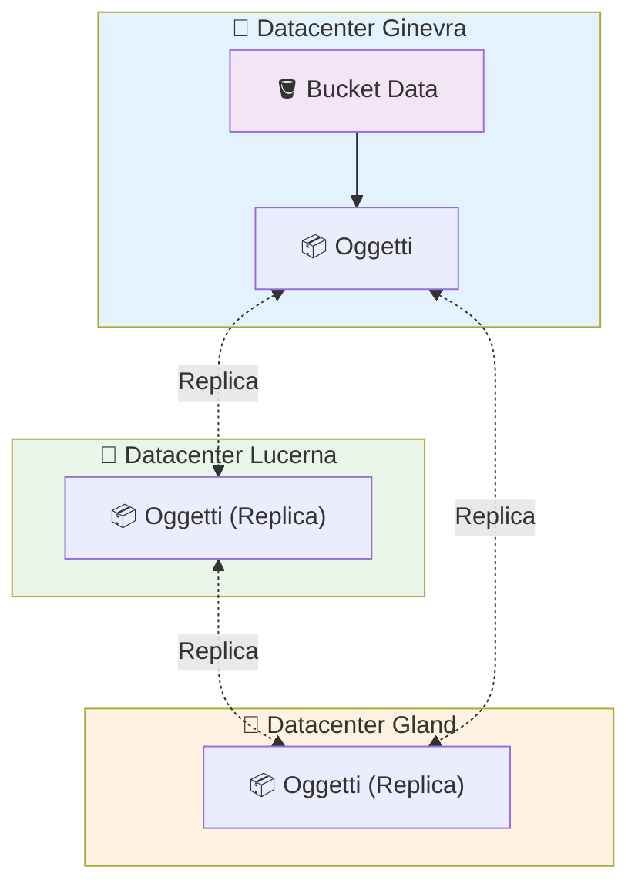

# Bucket S3 su Hikube

I **Bucket S3** di Hikube offrono una soluzione di archiviazione oggetti **altamente disponibile**, **replicata** e **compatibile S3** per le vostre applicazioni cloud-native, backup, artefatti CI/CD o dati analitici.
La piattaforma fornisce un'alternativa sovrana e performante ad Amazon S3, con un'integrazione nativa con Kubernetes.

---

## 🏗️ Architettura e Funzionamento

### **Archiviazione Oggetti Distribuita**

I bucket Hikube si basano su un'architettura S3 **100% distribuita e replicata** su più datacenter.
A differenza dei volumi block utilizzati per le VM, l'archiviazione oggetti non è collegata a una macchina: è accessibile tramite **API S3 standardizzate** da qualsiasi applicazione o servizio autorizzato.

#### 📦 Livello di Archiviazione

- Ogni bucket è ospitato su un'**infrastruttura multi-nodo** distribuita tra più datacenter svizzeri
- Gli oggetti sono **replicati automaticamente** su 3 zone fisiche distinte per garantire la massima durabilità
- Il sistema è progettato per tollerare il guasto di un datacenter completo senza perdita di dati né indisponibilità

#### 🌐 Livello di Accesso

- I bucket sono accessibili tramite un **endpoint HTTPS unico** compatibile con la firma S3 v4
- L'accesso è autenticato tramite **Access Key S3** generate automaticamente alla creazione del bucket
- Ogni bucket è isolato nel proprio tenant Kubernetes e dispone delle proprie credenziali

---

### **Architettura Multi-Datacenter**



Questa architettura garantisce la **disponibilità e la durabilità** dei dati, pur essendo interamente gestita in Svizzera 🇨🇭.

---

## ⚙️ Casi d'Uso Tipici

I bucket Hikube sono progettati per coprire un ampio ventaglio di scenari di archiviazione cloud:

| **Caso d'Uso**                  | **Descrizione**                                                   |
| ------------------------------- | ----------------------------------------------------------------- |
| **Backup**                      | Backup automatizzati di applicazioni o volumi persistenti         |
| **Artefatti CI/CD**             | Archiviazione di immagini, binari e pipeline GitOps               |
| **Contenuto statico**           | Hosting di file pubblici (asset web, PDF, immagini)               |
| **Dati analitici**              | Centralizzazione di file CSV/Parquet/JSON per ETL e strumenti BI  |
| **Log e archivi**               | Archiviazione a lungo termine dei log applicativi e di audit      |
| **Snapshot ed export VM**       | Archiviazione di snapshot KubeVirt, export RAW o QCOW2            |
| **Applicazioni S3-compatibili** | Utilizzo diretto da app di terze parti tramite SDK o AWS CLI      |

---

## 🔒 Isolamento e Sicurezza

### **Separazione per Tenant**

Ogni bucket è **provisionato in un namespace Kubernetes specifico**, garantendo un isolamento rigoroso:

- Le credenziali sono uniche per bucket e archiviate in un Secret Kubernetes generato automaticamente
- Nessun dato né chiave di accesso è condiviso tra tenant

### **Crittografia e Accesso Sicuro**

- Tutti gli accessi passano tramite **HTTPS/TLS** con autenticazione per chiave S3
- L'endpoint non consente l'accesso anonimo: una chiave valida è sempre richiesta

---

## 🌐 Connettività e Integrazione

### **Endpoint S3 Unico**

Tutti i bucket sono accessibili tramite l'endpoint unico:

```url
https://prod.s3.hikube.cloud
```

### **Compatibilità Totale**

Hikube è compatibile con gli strumenti e gli SDK AWS S3 standard:

- **AWS CLI**: `aws s3 --endpoint-url https://prod.s3.hikube.cloud ...`
- **MinIO Client (`mc`)**: configurazione semplice di un alias con Access Key / Secret Key
- **Rclone / S3cmd / Velero / Restic**: supporto nativo tramite la firma v4

Questo consente un'integrazione fluida nelle pipeline CI/CD, negli strumenti di backup e nelle applicazioni analitiche esistenti, senza adattamenti specifici.

---

## 📦 Gestione e Portabilità

### **Ciclo di Vita Semplice**

- La creazione e l'eliminazione dei bucket avvengono tramite un semplice manifesto Kubernetes
- Le credenziali sono generate automaticamente e archiviate in un Secret in formato JSON (`BucketInfo`)
- Nessuna configurazione manuale è richiesta

### **Interoperabilità Standard**

Grazie alla compatibilità S3, i vostri dati restano **interoperabili** con:

- Strumenti cloud esistenti (AWS CLI, Velero...)
- Pipeline di migrazione S3 standard (rclone sync, s3cmd mirror...)
- Servizi di analisi esterni (Spark, DuckDB, ecc.)

---

## 🚀 Prossimi Passi

Ora che comprendete l'architettura dei Bucket Hikube:

**🏃‍♂️ Avvio Immediato**
→ [Creare il vostro primo bucket](./quick-start.md)

**📖 Configurazione Avanzata**
→ [Riferimento API completo](./api-reference.md)

:::tip Raccomandazione Produzione
Utilizzate un bucket dedicato per applicazione o ambiente.
:::
