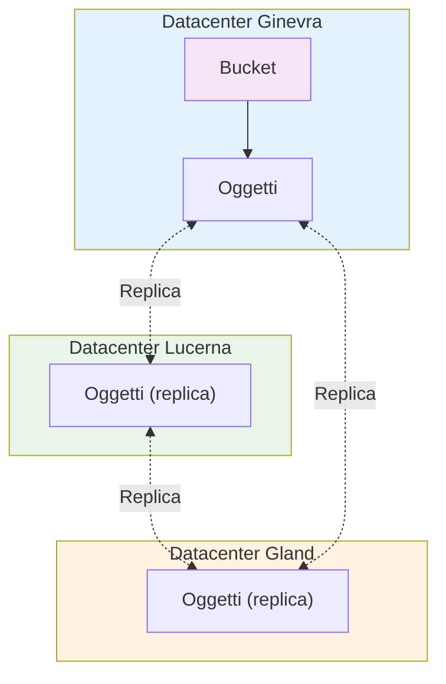

import NavigationFooter from '@site/src/components/NavigationFooter';

# Bucket S3 su Hikube

I **bucket S3** di Hikube offrono una soluzione di storage a oggetti **ad alta disponibilità**, **replicata** e **compatibile S3** per le sue applicazioni cloud-native, i backup, gli artefatti CI/CD o i dati analitici.
La piattaforma fornisce un'alternativa sovrana ad Amazon S3, gestita in Svizzera.

Crea e gestisce i suoi bucket in modalità self-service dalla [console Hikube](https://console.hikube.cloud), nel menu **Infrastructure** → **S3 Buckets** del suo progetto.

---

## Cosa permette di fare la console

- **Creare un bucket**, con l'opzione di **blocco degli oggetti (Object Lock / WORM)** e di **cifratura a riposo (LUKS)**;
- **Creare utenti S3** per ogni bucket, in **sola lettura** o in **lettura / scrittura**, con la relativa coppia di chiavi di accesso;
- **Consultare il nome S3 effettivo e l'endpoint** del bucket, con esempi di comandi pronti da copiare;
- **Modificare i diritti** di un utente ed **eliminare** un utente o un bucket.

---

## Architettura e funzionamento

### Storage a oggetti distribuito

I bucket Hikube si basano su un'architettura S3 **distribuita e replicata** su più datacenter.
A differenza dei [dischi](../disks/overview.md) utilizzati dalle macchine virtuali, lo storage a oggetti non è collegato ad alcuna macchina: è accessibile tramite l'**API S3 standard** da qualsiasi applicazione o servizio autorizzato.

#### Livello di storage

- Ogni bucket è ospitato su un'**infrastruttura multi-nodo** distribuita tra più datacenter svizzeri
- Gli oggetti sono **replicati automaticamente** su 3 siti fisici distinti
- Il sistema è progettato per tollerare il guasto di un intero datacenter senza perdita di dati

#### Livello di accesso

- I bucket sono accessibili tramite un **endpoint HTTPS** compatibile con la firma S3 v4
- L'accesso è autenticato tramite **chiavi di accesso S3** (Access Key ID / Secret Access Key) proprie di ciascun utente del bucket
- Ogni bucket appartiene a un **progetto** e i suoi utenti hanno accesso solo a quel bucket

---

### Architettura multi-datacenter

```mermaid
flowchart TD
    subgraph DC1["Datacenter Ginevra"]
        B1["Bucket"]
        S1["Oggetti"]
    end

    subgraph DC2["Datacenter Lucerna"]
        S2["Oggetti (replica)"]
    end

    subgraph DC3["Datacenter Gland"]
        S3["Oggetti (replica)"]
    end

    B1 --> S1
    S1 <-.->|"Replica"| S2
    S2 <-.->|"Replica"| S3
    S1 <-.->|"Replica"| S3

    style DC1 fill:#e3f2fd
    style DC2 fill:#e8f5e8
    style DC3 fill:#fff2e1
    style B1 fill:#f3e5f5
```

Questa architettura garantisce la **disponibilità e la durabilità** dei dati, pur restando interamente gestita in Svizzera.

---

## Casi d'uso tipici

| **Caso d'uso**                  | **Descrizione**                                                   |
| ------------------------------- | ----------------------------------------------------------------- |
| **Backup**                      | Backup automatizzati di applicazioni o di volumi persistenti      |
| **Artefatti CI/CD**             | Archiviazione di immagini, binari e pipeline GitOps               |
| **Contenuti statici**           | File serviti dalle sue applicazioni (asset web, PDF, immagini)    |
| **Dati analitici**              | Centralizzazione di file CSV/Parquet/JSON per ETL e strumenti BI  |
| **Log e archivi**               | Conservazione a lungo termine dei log applicativi e di audit      |
| **Archiviazione normativa**     | Conservazione non modificabile con il blocco WORM                 |
| **Applicazioni compatibili S3** | Utilizzo diretto da parte di applicazioni tramite SDK o AWS CLI   |

---

## Isolamento e sicurezza

- Ogni utente S3 dispone di **chiavi proprie** e ha accesso solo al bucket a cui è associato
- Il diritto di **sola lettura** permette di concedere un accesso in consultazione senza rischio di modifica
- Tutti gli accessi passano per **HTTPS** con autenticazione tramite chiave S3; l'accesso anonimo non è possibile
- La **cifratura a riposo (LUKS)** protegge i dati memorizzati su disco
- Il **blocco (WORM)** impedisce l'eliminazione o la modifica degli oggetti per 365 giorni

---

## Connettività e integrazione

### Endpoint S3

L'endpoint S3 e il nome effettivo del bucket sono visualizzati nella pagina del bucket, nella scheda **Access & Configuration** (ad esempio `prod.s3.hikube.cloud`).

### Compatibilità

I bucket Hikube sono compatibili con gli strumenti e gli SDK S3 standard:

- **AWS CLI**: `aws --endpoint-url https://<endpoint> s3 ...`
- **MinIO Client (`mc`)**: alias configurato con la chiave di accesso e la chiave segreta
- **rclone, s3cmd, Velero, Restic**: supporto nativo della firma v4
- **SDK**: boto3 (Python), AWS SDK (Go, Java, Node.js…)

---

## Passi successivi

- [Creare il primo bucket](./quick-start.md)
- [Gestire gli utenti e le chiavi di accesso](./how-to/configure-access.md)

:::tip Raccomandazione per la produzione
Utilizzi un bucket dedicato per applicazione o per ambiente, e un utente S3 distinto per applicazione.
:::

<NavigationFooter
  nextSteps={[
    {label: "Concetti", href: "../concepts"},
    {label: "Avvio rapido", href: "../quick-start"},
  ]}
/>
