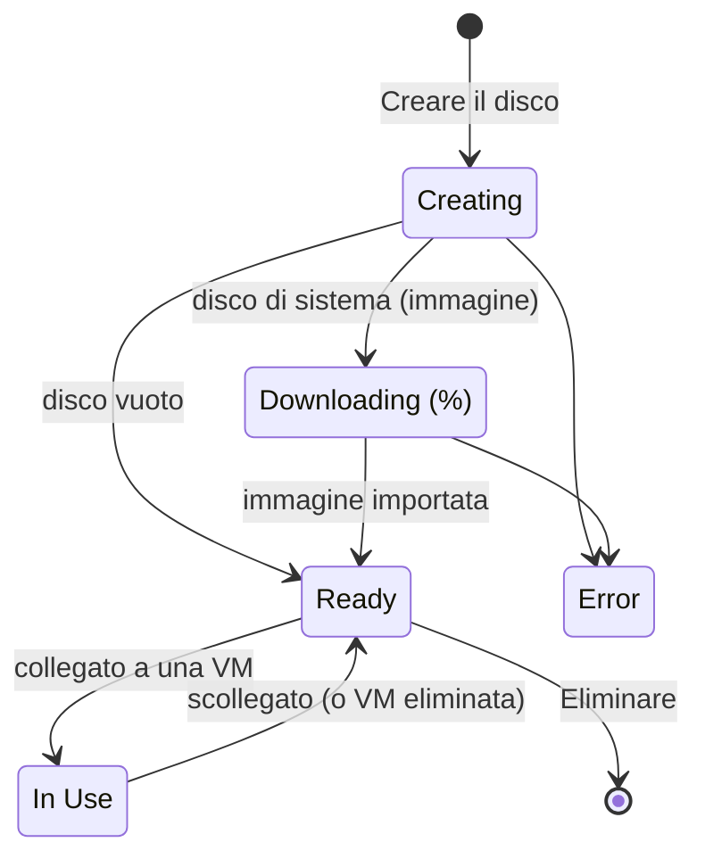

# Concetti — Dischi

## Architettura

Un disco Hikube è un **volume a blocchi persistente** che appartiene a un **progetto**. Consuma la quota di **storage** del progetto e può essere collegato a una macchina virtuale dello stesso progetto.

---

## Terminologia

| Termine | Descrizione |
|-------|-------------|
| **Disco** | Volume di storage a blocchi persistente, gestito dal menu **Infrastructure** → **Disks**. |
| **Empty Disk** | Disco dati grezzo, da formattare e montare nella VM (visualizzato come **Data Disk** nell'elenco). |
| **System Disk** | Disco creato a partire da un'immagine di sistema, utilizzabile come disco di avvio di una VM. |
| **Immagine cloud** | Immagine di sistema operativo del catalogo Hikube, scelta per OS e per versione. |
| **Immagine personalizzata** | Immagine ISO o QCOW2 importata da un URL HTTPS fornito da lei. |
| **Replica** | Copia dei dati del disco su più nodi, in modalità sincrona o asincrona. |
| **Cifratura (LUKS)** | Cifratura dei dati a riposo sul disco. |
| **Attached to** | VM che sta attualmente utilizzando il disco. |

---

## Stati

| Stato | Significato |
|--------|---------------|
| **Creating** | Il disco è in fase di provisioning |
| **Downloading** | L'immagine di un disco di sistema è in fase di importazione; l'avanzamento è mostrato in percentuale |
| **Ready** | Il disco è stato fornito e non è collegato ad alcuna VM |
| **In Use** | Il disco è collegato a una VM |
| **Error** | Il download dell'immagine o il provisioning non è riuscito |
| **Unknown** | Non è stato ancora possibile determinare lo stato del disco |

---

## Origine del disco

Il passaggio **Source** della procedura guidata propone due scelte:

- **Empty Disk**: «Raw storage space that can be formatted and mounted on a virtual machine.»
- **System Disk**: «A disk containing a pre-installed operating system.» Sceglie quindi un'immagine in **OS Image / Source**:
  - un'**immagine cloud** del catalogo (OS e poi **Version**);
  - oppure **Custom Image**: un **Image URL (ISO/QCOW2)**. L'URL deve utilizzare HTTPS; gli indirizzi IP privati o locali vengono rifiutati.

:::note Windows
Un disco di sistema Windows deve avere almeno **50 GB**. Il suo costo stimato include la licenza Windows.
:::

---

## Replica

| Modalità | Etichetta | Comportamento | RTO | RPO |
|------|---------|--------------|-----|-----|
| Asincrona | **Asynchronous Replication** (Recommended) | Replica differita: in caso di guasto simultaneo di più nodi, una piccola quantità di dati recenti può andare persa | < 5 min | < 5 min |
| Sincrona | **Synchronous Replication** | Replica in tempo reale su più nodi: perdita di dati minima in caso di guasto | < 5 min | < 1 min |

La **Asynchronous Replication** è selezionata per impostazione predefinita.

---

## Cifratura

L'interruttore **Disk Encryption** attiva la cifratura **LUKS** dei dati a riposo. Un disco cifrato è contrassegnato dal badge **Encrypted** nell'elenco e ha una tariffa distinta.

:::warning Opzioni fissate alla creazione
L'origine, la replica e la cifratura si scelgono alla creazione. In seguito è possibile modificare solo la **dimensione** di un disco, e unicamente aumentandola.
:::

---

## Dimensione e quota

- Dimensione minima: **20 GB** (50 GB per un disco di sistema Windows).
- La dimensione è limitata dalla **quota di storage** del progetto; la procedura guidata mostra l'indicatore **Estimated project usage**.
- Un disco può essere **ingrandito**, mai ridotto (vedere [Ridimensionare un disco](./how-to/resize.md)).

---

## Tariffe

La procedura guidata mostra un **Estimated Cost**: la tariffa per GB al mese e il costo mensile del disco. La tariffa dipende dalla cifratura; un disco di sistema Windows aggiunge il costo della licenza.

---

## Limiti

| Parametro | Valore |
|-----------|--------|
| Nome del disco | Da 3 a 16 caratteri: lettere minuscole, cifre e trattini; inizia con una lettera, termina con una lettera o una cifra |
| Dimensione | A partire da 20 GB, entro il limite della quota di storage del progetto |
| Collegamento | Una sola VM alla volta |
| Riduzione della dimensione | Non supportata |

---

## Per approfondire

- [Avvio rapido](./quick-start.md): creare un disco e utilizzarlo in una VM
- [Collegare un disco a una VM](./how-to/attach-to-vm.md)
- [Creare un disco di sistema a partire da un'immagine](./how-to/create-from-image.md)
