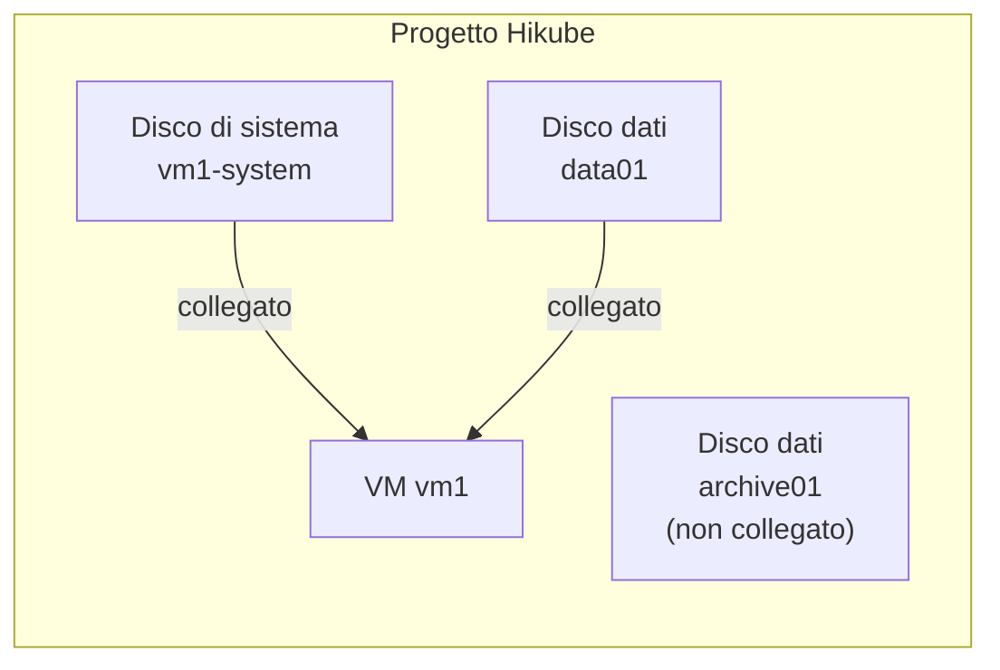

import NavigationFooter from '@site/src/components/NavigationFooter';

# Dischi su Hikube

I **dischi** Hikube sono **volumi di storage a blocchi persistenti** e replicati, che lei collega alle sue [macchine virtuali](../../compute/overview.md). Un disco esiste indipendentemente dalla VM che lo utilizza: può crearlo in anticipo, collegarlo, scollegarlo, ingrandirlo o ricollegarlo a un'altra VM, senza perderne i dati.

Gestisce i suoi dischi in modalità self-service dalla [console Hikube](https://console.hikube.cloud), nel menu **Infrastructure** → **Disks** del suo progetto.

---

## Cosa permette di fare la console

- **Creare un disco vuoto** (disco dati) o un **disco di sistema** a partire da un'immagine (immagine cloud del catalogo o immagine personalizzata ISO/QCOW2);
- **Scegliere la replica** (**Asynchronous Replication** o **Synchronous Replication**) e attivare la **cifratura (LUKS)**;
- **Seguire lo stato** di ogni disco, compreso l'avanzamento del download di un'immagine;
- **Vedere a quale VM** è collegato un disco;
- **Ingrandire** un disco;
- **Eliminare** un disco che non è collegato ad alcuna VM.

Il collegamento di un disco a una VM avviene dalla procedura guidata di creazione o dalla pagina di modifica della VM (vedere [Collegare un disco a una VM](./how-to/attach-to-vm.md)).

---

## Tipi di dischi

| Tipo | Etichetta nella console | Utilizzo |
|------|------------------------|-------|
| Disco dati | **Empty Disk** / **Data Disk** | Spazio di storage grezzo da formattare e montare in una VM |
| Disco di sistema | **System Disk** | Disco contenente un sistema operativo preinstallato, utilizzato come disco di avvio di una VM |

---

## Dischi e VM

- Un disco è collegato a **una sola VM** alla volta.
- L'elenco **Storage Disks** mostra per ogni disco la VM a cui è collegato (**Attached to**).
- Eliminare una VM **scollega** i suoi dischi senza eliminarli: restano nell'elenco e possono essere riutilizzati.

---

## Replica e sicurezza

- **Asynchronous Replication** (consigliata): replica differita, RTO < 5 min, RPO < 5 min.
- **Synchronous Replication**: replica in tempo reale su più nodi, RTO < 5 min, RPO < 1 min.
- **Disk Encryption**: cifratura LUKS dei dati a riposo.

I dettagli sono presentati nei [concetti](./concepts.md).

---

## Casi d'uso tipici

| Caso d'uso | Descrizione |
|-------------|-------------|
| **Dati applicativi** | Volume dedicato per un database o per file, separato dal disco di sistema |
| **Preparazione di una VM** | Disco di sistema creato in anticipo da un'immagine, poi collegato a una nuova VM |
| **Migrazione tra VM** | Scollegare un disco da una VM e collegarlo a un'altra |
| **Dati sensibili** | Disco cifrato (LUKS) con replica sincrona |

:::tip
Per uno storage di file accessibile tramite API da più applicazioni, utilizzi piuttosto i [Bucket S3](../buckets/overview.md).
:::

<NavigationFooter
  nextSteps={[
    {label: "Concetti", href: "../concepts"},
    {label: "Avvio rapido", href: "../quick-start"},
  ]}
  seeAlso={[
    {label: "Macchine virtuali", href: "../../../compute/overview"},
  ]}
/>
