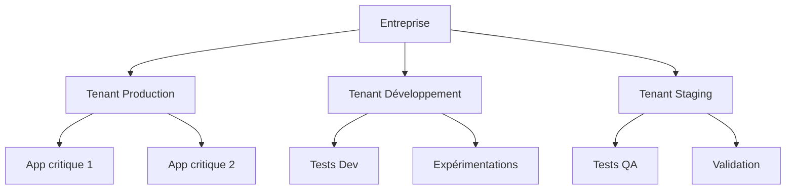
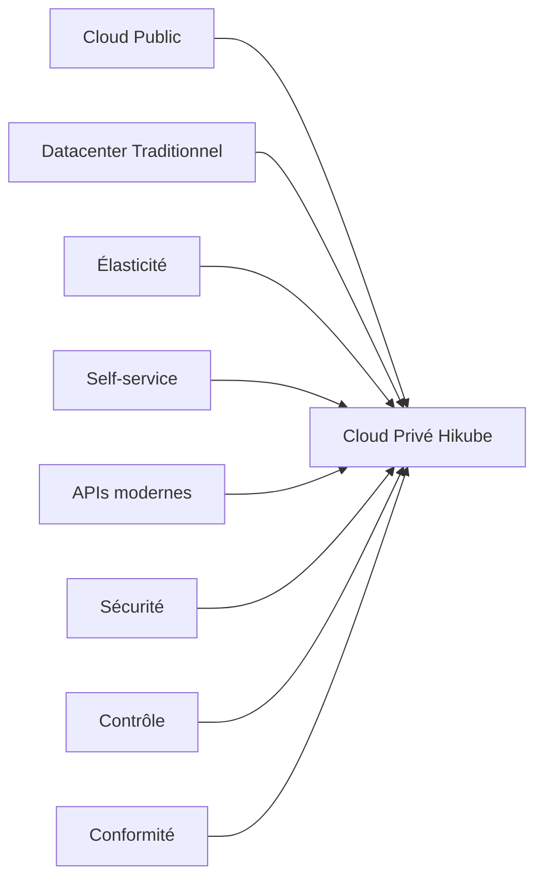
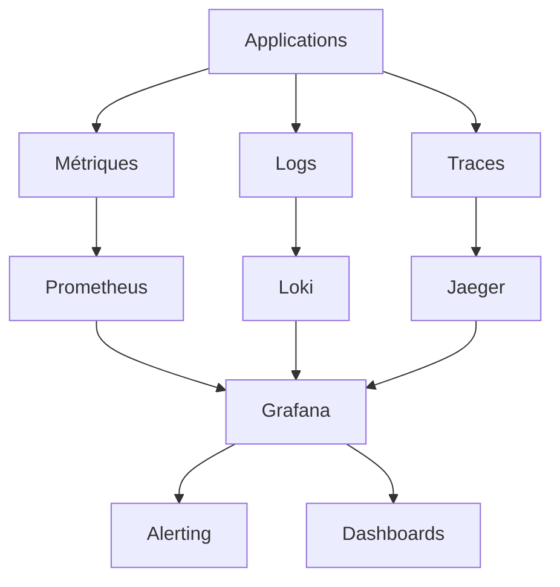

# 📖 Concepts clés d'Hikube

Cette page vous explique les **concepts fondamentaux** qui font d'Hikube une plateforme cloud unique. Comprendre ces concepts vous permettra de tirer le meilleur parti de votre infrastructure et de prendre des décisions éclairées.

---

## 🏢 Tenants : Votre Espace Privé

### **Qu'est-ce qu'un Tenant ?**
Un **tenant** est votre environnement isolé et sécurisé au sein de Hikube. C'est comme avoir votre propre "datacenter virtuel" avec :
- **Ressources dédiées** (CPU, RAM, stockage)
- **Réseau isolé** avec firewall intégré
- **Utilisateurs et permissions** séparés
- **Politiques de sécurité** personnalisées

### **Pourquoi cette approche ?**


**Avantages concrets :**
- 🔒 **Isolation totale** : Aucun impact entre environnements
- 👥 **Gestion des équipes** : Permissions granulaires par tenant
- 🔧 **Politiques différenciées** : Production vs développement
- 💰 **Facturation séparée** : Suivi des coûts par projet

### **Cas d'usage typiques**
| Tenant | Usage | Exemples |
|--------|-------|----------|
| **Production** | Applications critiques | Sites web, APIs, bases de données |
| **Staging** | Tests pré-production | Validation, performance tests |
| **Development** | Développement actif | Prototypes, expérimentations |
| **Sandbox** | Formation/démonstration | Tests sans risque |

---

## 🛡️ Sécurité : Protection Multi-Niveaux

### **Architecture Zero-Trust**
Hikube applique le principe **"never trust, always verify"** à tous les niveaux :

```yaml
Sécurité Hikube:
  Infrastructure:
    - Chiffrement au repos (AES-256)
    - Chiffrement en transit (TLS 1.3)
    - Hardware Security Modules (HSM)
  
  Réseau:
    - Micro-segmentation automatique
    - Firewall distribué
    - Intrusion Detection System (IDS)
  
  Applications:
    - Pod Security Standards
    - Network Policies par défaut
    - Secret management intégré
  
  Accès:
    - Multi-Factor Authentication (MFA)
    - Role-Based Access Control (RBAC)
    - Audit complet des actions
```

### **Protection des Données**
- **Chiffrement transparent** : Vos données sont chiffrées automatiquement
- **Clés de chiffrement séparées** : Chaque tenant a ses propres clés
- **Rotation automatique** : Renouvellement régulier des secrets
- **Compliance** : RGPD, ISO 27001, SOC 2

### **Isolation Réseau**
```
┌─── Tenant A ───┐    ┌─── Tenant B ───┐
│  🔒 App 1      │    │  🔒 App 3      │
│  🔒 App 2      │    │  🔒 App 4      │
│  Private VLAN  │    │  Private VLAN  │
└────────────────┘    └────────────────┘
        │                     │
    🔥 Firewall         🔥 Firewall
        │                     │
     ☁️ Internet         ☁️ Internet
```

---

## ⚡ Redondance : Haute Disponibilité Native

### **Redondance Multi-Niveaux**
Hikube garantit la continuité de service grâce à une architecture redondante :

#### **Infrastructure Physique**
- **Serveurs multiples** : Pas de point de défaillance unique
- **Alimentation redondante** : Onduleurs et générateurs
- **Connexions réseau multiples** : Plusieurs fournisseurs d'accès
- **Refroidissement redondant** : Systèmes de climatisation multiples

#### **Données et Stockage**
- **Réplication synchrone** : Vos données sur 3+ nœuds minimum
- **Backup automatique** : Sauvegardes continues et testées
- **Geo-redondance** : Copies sur sites distants
- **Point-in-time recovery** : Restauration à n'importe quel moment

#### **Applications et Services**
- **Auto-scaling** : Adaptation automatique à la charge
- **Health checks** : Détection proactive des problèmes
- **Rolling updates** : Mises à jour sans interruption
- **Circuit breakers** : Protection contre les cascades de pannes

### **SLA et Garanties**
| Composant | Disponibilité | Temps d'arrêt max/an |
|-----------|---------------|---------------------|
| **Infrastructure** | 99.95% | 4.38 heures |
| **Stockage** | 99.99% | 52.6 minutes |
| **Réseau** | 99.9% | 8.77 heures |
| **Applications** | 99.9%+ | Selon configuration |

---

## ☁️ Cloud Privé : Le Meilleur des Deux Mondes

### **Qu'est-ce qu'un Cloud Privé ?**
Le cloud privé combine les **avantages du cloud public** (élasticité, simplicité) avec les **garanties du datacenter privé** (sécurité, contrôle).



### **Avantages Spécifiques**
| Aspect | Cloud Public | Datacenter Privé | **Hikube Cloud Privé** |
|--------|-------------|------------------|----------------------|
| **Sécurité** | ⚠️ Partagée | ✅ Totale | ✅ **Totale + Expertise** |
| **Performance** | ⚠️ Variable | ✅ Prévisible | ✅ **Optimisée + Prévisible** |
| **Coûts** | ⚠️ Imprévisibles | ❌ CAPEX élevé | ✅ **OPEX prévisible** |
| **Agilité** | ✅ Immédiate | ❌ Lente | ✅ **Immédiate + Contrôlée** |
| **Compliance** | ⚠️ Limitée | ✅ Complète | ✅ **Complète + Simplifiée** |

### **Cas d'Usage Idéaux**
- **Données sensibles** : Finance, santé, défense
- **Applications critiques** : Systèmes de paiement, ERP
- **Conformité stricte** : RGPD, HIPAA, PCI-DSS
- **Performance garantie** : Applications temps réel, trading

---

## 🎛️ Infrastructure as Code (IaC)

### **Gestion Déclarative**
Avec Hikube, vous décrivez **ce que vous voulez**, la plateforme s'occupe du **comment** :

```yaml
# Exemple : Cluster Kubernetes haute disponibilité
apiVersion: apps.cozystack.io/v1alpha1
kind: Kubernetes
metadata:
  name: production-cluster
spec:
  replicas: 5                    # 5 nœuds automatiquement
  version: "1.28"               # Version Kubernetes
  monitoring:
    enabled: true               # Observabilité intégrée
  backup:
    schedule: "0 2 * * *"       # Backup quotidien 2h
    retention: "30d"            # Conservation 30 jours
  networking:
    cni: cilium                 # Réseau sécurisé
    policies: strict            # Policies réseau strictes
```

### **Avantages de l'Approche Déclarative**
- **Reproductibilité** : Même configuration = même résultat
- **Versionning** : Historique des changements
- **Collaboration** : Code partagé et révisé
- **Automatisation** : CI/CD natif

---

## 🔄 Observabilité et Monitoring

### **Monitoring Intégré**
Hikube inclut nativement tous les outils d'observabilité modernes :



### **Métriques et Alertes**
- **Métriques infrastructure** : CPU, RAM, disque, réseau
- **Métriques applicatives** : Latence, erreurs, throughput
- **Alertes intelligentes** : Machine learning pour réduire le bruit
- **Escalation automatique** : Notifications graduées selon la criticité

### **Logs Centralisés**
- **Collecte automatique** : Tous les logs aggregés
- **Recherche avancée** : Filtres et corrélations
- **Rétention configurable** : Selon vos politiques
- **Export facilité** : Intégration SIEM externe

---

## 🚀 Évolutivité et Performance

### **Scaling Automatique**
Hikube adapte automatiquement les ressources à vos besoins :

#### **Horizontal Pod Autoscaling (HPA)**
```yaml
# Scaling basé sur les métriques
spec:
  minReplicas: 2
  maxReplicas: 50
  targetCPUUtilizationPercentage: 70
  targetMemoryUtilizationPercentage: 80
```

#### **Vertical Pod Autoscaling (VPA)**
```yaml
# Optimisation automatique des ressources
spec:
  updateMode: "Auto"        # Ajustement automatique
  resourcePolicy:
    cpu:
      min: 100m
      max: 2000m
```

#### **Cluster Autoscaling**
- **Ajout automatique** de nœuds selon la demande
- **Suppression intelligente** des nœuds sous-utilisés
- **Optimisation des coûts** en temps réel

### **Performance Optimisée**
- **SSD NVMe** pour le stockage haute performance
- **Réseau 10Gbps+** pour la bande passante
- **CPU dernière génération** pour le calcul intensif
- **GPU** disponibles pour l'IA et le calcul scientifique

---

## 🔧 Intégrations et Écosystème

### **Outils DevOps Natifs**
Hikube s'intègre parfaitement avec votre stack existant :

| Catégorie | Outils Supportés |
|-----------|------------------|
| **CI/CD** | GitLab CI, GitHub Actions, Jenkins, Tekton |
| **Monitoring** | Prometheus, Grafana, DataDog, New Relic |
| **Logs** | ELK Stack, Fluentd, Loki, Splunk |
| **Security** | Falco, OPA, Vault, Cert-Manager |
| **Storage** | Ceph, MinIO, NFS, iSCSI |

### **APIs Standards**
- **Kubernetes API** : Compatibilité totale
- **OpenStack API** : Pour les VMs et le réseau
- **S3 API** : Pour le stockage objet
- **Prometheus API** : Pour les métriques

---

## 💡 Bonnes Pratiques

### **Organisation des Tenants**
```
Entreprise
├── production (critique)
│   ├── web-frontend
│   ├── api-backend
│   └── database
├── staging (test pré-prod)
│   ├── integration-tests
│   └── performance-tests
├── development (dev actif)
│   ├── feature-branches
│   └── experiments
└── sandbox (formation)
    ├── training
    └── demos
```

### **Sécurité par Défaut**
- **Principle of least privilege** : Permissions minimales
- **Defense in depth** : Sécurité multi-couches
- **Regular audits** : Revues périodiques des accès
- **Automated updates** : Patches de sécurité automatiques

### **Monitoring Proactif**
- **SLI/SLO définies** : Objectifs mesurables
- **Runbooks automatisés** : Réponses aux incidents
- **Chaos engineering** : Tests de résilience
- **Post-mortems** : Apprentissage continu

---

## 🎯 Prochaines Étapes

Maintenant que vous maîtrisez les concepts d'Hikube, vous pouvez :

### **🚀 Mettre en Pratique**
- **[Déployer Kubernetes](../services/kubernetes/)** → Créez votre premier cluster
- **[Configurer des VMs](../services/compute/virtual-machines/)** → Infrastructure hybride
- **[Gérer le stockage](../services/storage/)** → Données persistantes

### **🔧 Automatiser**
- **[Terraform](../tools/terraform.md)** → Infrastructure as Code
- **[CLI](../tools/cli.md)** → Scripts et automatisation

### **📚 Approfondir**
- **[FAQ](../resources/faq.md)** → Questions fréquentes
- **[Troubleshooting](../resources/troubleshooting.md)** → Résolution de problèmes

:::success Félicitations ! 🎉
Vous maîtrisez maintenant les concepts fondamentaux d'Hikube. Vous êtes prêt à construire une infrastructure robuste, sécurisée et évolutive !
:::

---

**Recommandation :** Commencez par explorer les **[Services](../services/)** pour voir comment ces concepts s'appliquent concrètement à chaque composant d'Hikube. 