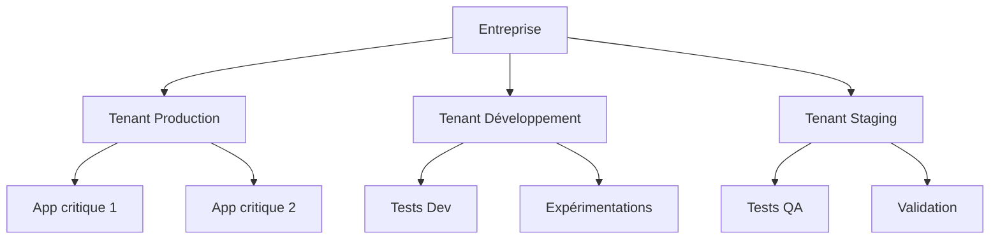
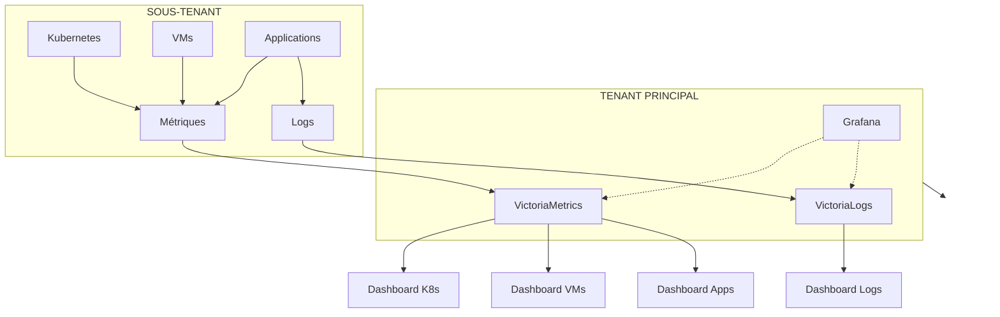

# Concepts clés d'Hikube

Cette page vous explique les **concepts fondamentaux** qui font d'Hikube une plateforme cloud unique. Comprendre ces concepts vous permettra de tirer le meilleur parti de votre infrastructure et de prendre des décisions éclairées.

---

## Tenants : Votre Espace Privé

### **Qu'est-ce qu'un Tenant ?**
Un **tenant** est votre environnement isolé et sécurisé au sein de Hikube. C'est comme avoir votre propre "datacenter virtuel" avec :
- **Réseau isolé**
- **Utilisateurs et permissions** séparés 
- **Politiques de sécurité** personnalisées
- **Sous-tenants** à disposition

### **Pourquoi cette approche ?**

**Avantages concrets :**
- **Isolation totale** : Aucun impact entre environnements
- **Gestion des équipes** : Permissions granulaires par tenant
- **Politiques différenciées** : Production vs développement
- **Facturation séparée** : Suivi des coûts par projet

### **Cas d'usage typiques**
| Tenant | Usage |
|--------|-------|
| **Production** | Applications critiques |
| **Staging** | Tests pré-production |
| **Development** | Développement actif |
| **Sandbox** | Formation/démonstration |

---

## Infrastructure as Code (IaC)

### **Pensé pour l'Industrialisation**
Hikube est conçu pour l'automatisation et l'industrialisation de votre infrastructure. Toutes les fonctionnalités sont accessibles via :

- **API complète** : Intégration native dans vos pipelines CI/CD
- **CLI puissant** : Automatisation et scripts pour vos équipes DevOps
- **Déclaratif** : Décrivez l'état souhaité, Hikube s'occupe du reste

### **Avantages de l'Approche Industrielle**
- **Reproductibilité** : Déploiements identiques à chaque fois
- **Versionning** : Suivi complet des changements infrastructure
- **Collaboration** : Code partagé entre équipes développement et ops
- **Automatisation** : Intégration transparente dans vos workflows

---

## Observabilité et Monitoring

### **Stack Monitoring Complète**

Hikube vous permet de déployer votre propre stack de monitoring dans votre tenant avec **Grafana + VictoriaMetrics + VictoriaLogs**. Cette stack peut centraliser les données de tous vos sous-tenants pour une vision globale de votre infrastructure.

### **Architecture Multi-Tenant du Monitoring**

#### **Centralisation Intelligente**
- **Tenant principal** : Héberge la stack Grafana + VictoriaMetrics + VictoriaLogs
- **Sous-tenants** : Génèrent métriques et logs automatiquement
- **Remontée sécurisée** : Agrégation centralisée avec isolation des données
- **Vue globale** : Dashboard unifié de toute votre infrastructure

#### **Dashboards par Ressource**

Hikube fournit des **dashboards préconfigurés** pour chaque type de ressource :

| **Type de Ressource** | **Dashboard Inclus** | **Métriques Clés** |
|---------------------------|-------------------------|------------------------|
| **Kubernetes** | Cluster, Nodes, Pods, Services | CPU, RAM, réseau, stockage |
| **Machines Virtuelles** | Host, VM, Performance | Utilisation, I/O, disponibilité |
| **Bases de Données** | MySQL, PostgreSQL, Redis | Connexions, requêtes, cache |
| **Applications** | Performances, Erreurs | Latence, throughput, 5xx |
| **Réseau** | LoadBalancer, VPN | Trafic, latence, connexions |
| **Stockage** | Buckets, Volumes | Capacité, IOPS, transferts |

---

## Prochaines Étapes

Maintenant que vous maîtrisez les concepts d'Hikube, vous pouvez :

### **Mettre en Pratique**
- **[Déployer Kubernetes](../services/kubernetes/)** → Créez votre premier cluster
- **[Configurer des VMs](../services/compute/virtual-machines/)** → Infrastructure hybride
- **[Gérer le stockage](../services/storage/)** → Données persistantes

### **Automatiser**
- **[Terraform](../tools/terraform.md)** → Infrastructure as Code
- **[CLI](../tools/cli.md)** → Scripts et automatisation

### **Approfondir**
- **[FAQ](../resources/faq.md)** → Questions fréquentes
- **[Troubleshooting](../resources/troubleshooting.md)** → Résolution de problèmes

---

**Recommandation :** Commencez par explorer les **[Services](../services/)** pour voir comment ces concepts s'appliquent concrètement à chaque composant d'Hikube. 