# 📖 Concepts clés d'Hikube

Cette page vous explique les **concepts fondamentaux** qui font d'Hikube une plateforme cloud unique. Comprendre ces concepts vous permettra de tirer le meilleur parti de votre infrastructure et de prendre des décisions éclairées.

---

## 🏢 Tenants : Votre Espace Privé

### **Qu'est-ce qu'un Tenant ?**
Un **tenant** est votre environnement isolé et sécurisé au sein de Hikube. C'est comme avoir votre propre "datacenter virtuel" avec :
- **Réseau isolé**
- **Utilisateurs et permissions** séparés 
- **Politiques de sécurité** personnalisées
- **Sous-tenants** à disposition

### **Pourquoi cette approche ?**

```mermaid
graph TB
    A[Entreprise] --> B[Tenant Production]
    A --> C[Tenant Développement] 
    A --> D[Tenant Staging]
    
    B --> E[App critique 1]
    B --> F[App critique 2]
    
    C --> G[Tests Dev]
    C --> H[Expérimentations]
    
    D --> I[Tests QA]
    D --> J[Validation]
```


**Avantages concrets :**
- 🔒 **Isolation totale** : Aucun impact entre environnements
- 👥 **Gestion des équipes** : Permissions granulaires par tenant
- 🔧 **Politiques différenciées** : Production vs développement
- 💰 **Facturation séparée** : Suivi des coûts par projet

### **Cas d'usage typiques**
| Tenant | Usage | Exemples |
|--------|-------|----------|
| **Production** | Applications critiques | Sites web, APIs, bases de données |
| **Staging** | Tests pré-production | Validation, performance tests |
| **Development** | Développement actif | Prototypes, expérimentations |
| **Sandbox** | Formation/démonstration | Tests sans risque |

---

## 🛡️ Sécurité : Protection Multi-Niveaux

### **Architecture Zero-Trust**
Hikube applique le principe **"never trust, always verify"** à tous les niveaux :

```yaml
Sécurité Hikube:
  Infrastructure:
    - Chiffrement au repos (AES-256)
    - Chiffrement en transit (TLS 1.3)
  
  Réseau:
    - Micro-segmentation automatique
    - Firewall distribué
    - Intrusion Detection System (IDS)
  
  Applications:
    - Security Standards
    - Network Policies par défaut
    - Secret management 
  
  Accès:
    - Multi-Factor Authentication (MFA)
    - Role-Based Access Control (RBAC)
    - Audit complet des actions
```

### **Protection des Données**
- **Chiffrement transparent** : Vos données sont chiffrées automatiquement at rest
- **Compliance** : RGPD, ISO 27001, FINMA

### **Isolation Réseau**
```
┌─── Tenant A ──-─-┐    ┌─── Tenant B ───--┐
│  🔒 App 1        │    │  🔒 App 3         │
│  🔒 App 2        │    │  🔒 App 4         │
│  Private Network │    │  Private Network │
└───────────────-─-┘    └────────────────--┘
        │                     │
    🔥 Firewall         🔥 Firewall
        │                     │
     ☁️ Internet         ☁️ Internet
```

---

## ⚡ Redondance : Haute Disponibilité Native

### **Redondance Multi-Niveaux**
Hikube garantit la continuité de service grâce à une architecture redondante :

#### **Infrastructure Physique**
- **Serveurs multiples** : Pas de point de défaillance unique
- **Alimentation redondante** : Onduleurs et générateurs
- **Connexions réseau multiples** : Plusieurs fournisseurs d'accès
- **Refroidissement redondant** : Systèmes de climatisation multiples

#### **Données et Stockage**
- **Réplication synchrone** : Vos données sur 3+ datacenters
- **Backup automatique** : Sauvegardes continues et testées
- **Geo-redondance** : Copies sur sites distants

#### **Applications et Services**
- **Auto-scaling** : Adaptation automatique à la charge
- **Health checks** : Détection proactive des problèmes
- **Rolling updates** : Mises à jour sans interruption
- **Circuit breakers** : Protection contre les cascades de pannes

---

## 🎛️ Infrastructure as Code (IaC)

### **Gestion Déclarative**
Avec Hikube, vous décrivez **ce que vous voulez**, la plateforme s'occupe du **comment** :

```yaml
# Exemple : Cluster Kubernetes haute disponibilité
apiVersion: apps.cozystack.io/v1alpha1
kind: Kubernetes
metadata:
  name: kube
  namespace: tenant-test <-- A modifer
spec:
  addons:
    certManager:
      enabled: true
      valuesOverride: {}
    fluxcd:
      enabled: false
      valuesOverride: {}
    ingressNginx:
      enabled: true
      hosts:
      - mon-nginx.kube.testmonitoring.hikube.cloud <-- A modifer
      valuesOverride: {}
    monitoringAgents:
      enabled: false
      valuesOverride: {}
    verticalPodAutoscaler:
      valuesOverride: {}
  controlPlane:
    replicas: 3
  host: kube.testmonitoring.hikube.cloud <-- A modifer
  kamajiControlPlane:
    addons:
      konnectivity:
        server:
          resources: {}
          resourcesPreset: small
    apiServer:
      resources: {}
      resourcesPreset: small
    controllerManager:
      resources: {}
      resourcesPreset: small
    scheduler:
      resources: {}
      resourcesPreset: small
  nodeGroups:
    md0:
      ephemeralStorage: 30Gi
      instanceType: u1.large
      maxReplicas: 6
      minReplicas: 3
      resources:
        cpu: ""
        memory: ""
      roles:
      - ingress-nginx
  storageClass: replicated

```

### **Avantages de l'Approche Déclarative**
- **Reproductibilité** : Même configuration = même résultat
- **Versionning** : Historique des changements
- **Collaboration** : Code partagé et révisé
---

## 🔄 Observabilité et Monitoring

### **Stack Monitoring Complète**

Hikube vous permet de déployer votre propre stack de monitoring dans votre tenant avec **Grafana + VictoriaMetrics + VictoriaLogs**. Cette stack peut centraliser les données de tous vos sous-tenants pour une vision globale de votre infrastructure.


### **Architecture Multi-Tenant du Monitoring**

#### **🎯 Centralisation Intelligente**
- **Tenant principal** : Héberge la stack Grafana + VictoriaMetrics + VictoriaLogs
- **Sous-tenants** : Génèrent métriques et logs automatiquement
- **Remontée sécurisée** : Agrégation centralisée avec isolation des données
- **Vue globale** : Dashboard unifié de toute votre infrastructure

#### **📊 Dashboards par Ressource**

Hikube fournit des **dashboards préconfigurés** pour chaque type de ressource :

| 🗂️ **Type de Ressource** | 📋 **Dashboard Inclus** | 🔍 **Métriques Clés** |
|---------------------------|-------------------------|------------------------|
| **☸️ Kubernetes** | Cluster, Nodes, Pods, Services | CPU, RAM, réseau, stockage |
| **🖥️ Machines Virtuelles** | Host, VM, Performance | Utilisation, I/O, disponibilité |
| **🗄️ Bases de Données** | MySQL, PostgreSQL, Redis | Connexions, requêtes, cache |
| **📦 Applications** | Performances, Erreurs | Latence, throughput, 5xx |
| **🌐 Réseau** | LoadBalancer, VPN | Trafic, latence, connexions |
| **💾 Stockage** | Buckets, Volumes | Capacité, IOPS, transferts |

---

## 🚀 Évolutivité et Performance

### **Gestion Dynamique des Ressources**

Hikube vous offre une **flexibilité totale** pour adapter vos ressources selon vos besoins :

- **📦 Applications** : Augmentez ou diminuez CPU, RAM et stockage en temps réel
- **🖥️ Machines Virtuelles** : Redimensionnement vertical (vCPU, mémoire, disques)
- **☸️ Clusters Kubernetes** : **Autoscaling automatique** avec ajout et suppression intelligente de nœuds
- **🏗️ NodePools Kubernetes** : Création de **pools de nœuds séparés** avec des caractéristiques spécifiques (CPU, GPU, stockage, labels)
- **📊 Pods Kubernetes** : **Vertical Pod Autoscaling (VPA)** pour l'optimisation automatique des ressources applicatives

Cette approche garantit des **performances optimales** tout en **maîtrisant les coûts** grâce à un dimensionnement précis et automatisé.

### **Performance Optimisée**
- **SSD NVMe** pour le stockage haute performance
- **CPU dernière génération** pour le calcul intensif
- **GPU** disponibles pour l'IA et le calcul scientifique

---

## 🔧 Intégrations et Écosystème

### **Outils DevOps Natifs**
Hikube s'intègre parfaitement avec votre stack existant :

### **APIs Standards**
- **Kubernetes API** : Compatibilité totale
- **S3 API** : Pour le stockage objet
- **Prometheus API** : Pour les métriques

---

## 💡 Bonnes Pratiques

### **Organisation des Tenants**
```
Entreprise
├── production (critique)
│   ├── web-frontend
│   ├── api-backend
│   └── database
├── staging (test pré-prod)
│   ├── integration-tests
│   └── performance-tests
├── development (dev actif)
│   ├── feature-branches
│   └── experiments
└── sandbox (formation)
    ├── training
    └── demos
```

### **Sécurité par Défaut**
- **Principle of least privilege** : Permissions minimales
- **Defense in depth** : Sécurité multi-couches
- **Regular audits** : Revues périodiques des accès
- **Automated updates** : Patches de sécurité automatiques

### **Monitoring Proactif**
- **SLI/SLO définies** : Objectifs mesurables
- **Runbooks automatisés** : Réponses aux incidents
- **Chaos engineering** : Tests de résilience
- **Post-mortems** : Apprentissage continu

---

## 🎯 Prochaines Étapes

Maintenant que vous maîtrisez les concepts d'Hikube, vous pouvez :

### **🚀 Mettre en Pratique**
- **[Déployer Kubernetes](../services/kubernetes/)** → Créez votre premier cluster
- **[Configurer des VMs](../services/compute/virtual-machines/)** → Infrastructure hybride
- **[Gérer le stockage](../services/storage/)** → Données persistantes

### **🔧 Automatiser**
- **[Terraform](../tools/terraform.md)** → Infrastructure as Code
- **[CLI](../tools/cli.md)** → Scripts et automatisation

### **📚 Approfondir**
- **[FAQ](../resources/faq.md)** → Questions fréquentes
- **[Troubleshooting](../resources/troubleshooting.md)** → Résolution de problèmes

:::success Félicitations ! 🎉
Vous maîtrisez maintenant les concepts fondamentaux d'Hikube. Vous êtes prêt à construire une infrastructure robuste, sécurisée et évolutive !
:::

---

**Recommandation :** Commencez par explorer les **[Services](../services/)** pour voir comment ces concepts s'appliquent concrètement à chaque composant d'Hikube. 