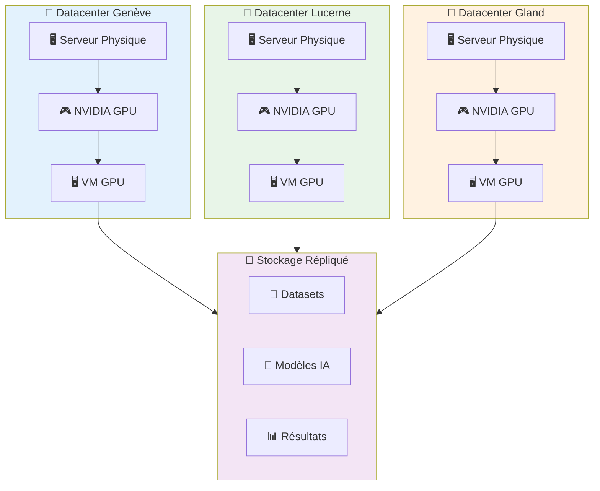

# 🎮 Machines Virtuelles GPU sur Hikube

Découvrez la puissance d'accélération des **GPUs NVIDIA** avec Hikube ! Nos machines virtuelles GPU offrent un accès direct aux accélérateurs les plus avancés via la technologie **GPU Passthrough**, permettant l'exécution de workloads intensifs d'intelligence artificielle, de calcul scientifique et de rendu graphique avec des performances quasi-natives.

---

## 🚀 Accès Rapide

  

    

      

        <h3>⚡ Démarrage Rapide</h3>
      

      

        

          Créez votre première VM GPU en 10 minutes avec notre guide pas-à-pas.
        

      

      

        <a className="button button--primary button--block" href="./quick-start">
          Commencer maintenant
        </a>
      

    

  

  
  

    

      

        <h3>📚 Référence API</h3>
      

      

        

          Documentation complète des APIs, configurations GPU et bonnes pratiques.
        

      

      

        <a className="button button--secondary button--block" href="./api-reference">
          Explorer l'API
        </a>
      

    

  

---

## 🎯 GPUs Disponibles

### **Gamme NVIDIA Professionnelle**

Hikube propose exclusivement des GPUs NVIDIA de dernière génération pour répondre aux besoins les plus exigeants :

**🚀 NVIDIA L40S**
- **Architecture** : Ada Lovelace 
- **Mémoire** : 48 GB GDDR6 avec ECC
- **Usage** : IA générative, rendu temps réel, simulation
- **Performance** : 362 TOPS (INT8), 91.6 TFLOPs (FP32)

**⚡ NVIDIA A100**
- **Architecture** : Ampere
- **Mémoire** : 80 GB HBM2e avec ECC
- **Usage** : Entraînement IA, calcul haute performance
- **Performance** : 312 TOPS (INT8), 624 TFLOPs (Tensor)

**🔥 NVIDIA H100**
- **Architecture** : Hopper
- **Mémoire** : 80 GB HBM3 avec ECC
- **Usage** : LLM, transformers, calcul exascale
- **Performance** : 1979 TOPS (INT8), 989 TFLOPs (Tensor)

---

## 🏗️ Architecture GPU Passthrough

### **Technologie de Virtualisation**

Hikube utilise **KubeVirt** avec le **GPU Operator** NVIDIA pour offrir un passthrough GPU complet :

### **Mécanisme VFIO-PCI**

- **Isolation matérielle** : GPU dédié exclusivement à la VM
- **Performance native** : Aucune virtualisation, accès direct au GPU
- **Pilotes NVIDIA** : Installation standard dans la VM
- **CUDA/ROCm** : Support complet des frameworks de calcul

---

## 💡 Cas d'Usage

### **🤖 Intelligence Artificielle**

**Entraînement de Modèles**
- **Deep Learning** : PyTorch, TensorFlow, JAX
- **Large Language Models** : BERT, GPT, LLaMA
- **Computer Vision** : YOLO, ResNet, Vision Transformers
- **Reinforcement Learning** : Stable Baselines, Ray RLlib

**Inférence et Production**
- **Serving de modèles** : TensorRT, ONNX Runtime
- **APIs ML** : FastAPI, BentoML, MLflow
- **Edge AI** : Déploiement optimisé pour latence

### **🔬 Calcul Scientifique**

**Simulation Numérique**
- **CFD** : OpenFOAM, ANSYS Fluent
- **Dynamique moléculaire** : GROMACS, LAMMPS
- **Astrophysique** : GADGET, RAMSES
- **Météorologie** : WRF, ICON

**Calcul Haute Performance**
- **CUDA** : Développement natif GPU
- **OpenACC** : Portage d'applications CPU
- **Bibliothèques optimisées** : cuBLAS, cuDNN, NCCL

### **🎨 Rendu et Visualisation**

**Production Multimédia**
- **Rendu 3D** : Blender, 3ds Max, Maya
- **Post-production** : DaVinci Resolve, Adobe Premiere
- **Streaming** : OBS Studio, FFmpeg avec NVENC

**Visualisation Scientifique**
- **ParaView** : Visualisation de données scientifiques
- **VisIt** : Analyse de simulations complexes
- **Jupyter** : Notebooks interactifs avec GPU

---

## 🔧 Fonctionnalités Avancées

### **🌐 Réseau Haute Performance**

**Connectivité Optimisée**
- **InfiniBand/Ethernet 100Gb** : Communication inter-nœuds
- **RDMA** : Accès mémoire distant direct
- **NCCL** : Communication collective optimisée NVIDIA

### **💾 Stockage Haute Performance**

**Storage Classes Spécialisées**
- **NVMe local** : Latence ultra-faible pour données temporaires
- **replicated** : Haute disponibilité pour datasets critiques
- **Volumes GPU-aware** : Optimisation lecture/écriture massive

### **📊 Monitoring GPU**

**Observabilité Complète**
- **NVIDIA DCGM** : Métriques temps réel des GPUs
- **Prometheus** : Collecte et historisation
- **Grafana** : Dashboards de performance détaillés
- **Alerting** : Surveillance proactive température/utilisation

---

## 🚦 Spécifications Techniques

### **💻 Configurations Recommandées**

**Configuration L40S**
- **vCPU** : 16-32 cœurs
- **RAM** : 128-256 GB
- **Stockage** : 500GB NVMe + datasets répliqués
- **Usage** : Inférence, rendu, développement

**Configuration A100**
- **vCPU** : 32-64 cœurs
- **RAM** : 256-512 GB
- **Stockage** : 1TB NVMe + datasets répliqués  
- **Usage** : Entraînement, calcul intensif

**Configuration H100**
- **vCPU** : 64-128 cœurs
- **RAM** : 512GB-1TB
- **Stockage** : 2TB NVMe + datasets répliqués
- **Usage** : LLM, recherche avancée

### **🔒 Sécurité et Isolation**

**Isolation GPU**
- **Un GPU = Une VM** : Pas de partage entre workloads
- **Tenant isolé** : Ressources dédiées par projet
- **Chiffrement** : Données en transit et au repos

---

## 🎯 Avantages Hikube

### **⚡ Performance Optimisée**

- **Latence ultra-faible** : Accès direct sans virtualisation
- **Bande passante maximale** : PCIe 4.0/5.0 native
- **Multi-GPU** : Support de configurations parallèles

### **🛠️ Simplicité d'Usage**

- **Images pré-configurées** : Pilotes NVIDIA inclus
- **Frameworks préinstallés** : CUDA, cuDNN, TensorRT
- **APIs Kubernetes** : Gestion déclarative standard

### **💰 Modèle Économique**

- **Facturation à l'usage** : Paiement par heure GPU
- **Scaling automatique** : Adaptation charge/coût
- **Partage intelligent** : Mutualisation infrastructure

---

## 💡 Cas d'Usage Populaires

### **🤖 Intelligence Artificielle**
- **Entraînement de réseaux de neurones profonds** : PyTorch, TensorFlow, JAX
- **Inférence de modèles LLM** : GPT, BERT, LLaMA avec optimisation TensorRT
- **Computer Vision** : YOLO, ResNet, Vision Transformers
- **Apprentissage par renforcement** : Stable Baselines, Ray RLlib

### **🔬 Calcul Scientifique**
- **Simulations numériques** : CFD (OpenFOAM), FEA (ANSYS)
- **Dynamique moléculaire** : GROMACS, LAMMPS
- **Calculs astrophysiques** : GADGET, RAMSES
- **Modélisation climatique** : WRF, ICON

### **🎨 Rendu et Visualisation**
- **Rendu 3D et animation** : Blender, 3ds Max, Maya
- **Post-production vidéo** : DaVinci Resolve, Adobe Premiere
- **Visualisation scientifique** : ParaView, VisIt
- **Streaming graphique** : OBS Studio, FFmpeg avec NVENC

---

## ✨ Avantages Hikube

:::info **🚀 Performance Native**
Accès direct au GPU via passthrough VFIO-PCI - aucune virtualisation, performance maximale garantie avec latence ultra-faible.
:::

:::info **🌍 Multi-Datacenter** 
VMs GPU disponibles sur nos 3 datacenters suisses (Genève, Lucerne, Gland) avec réplication automatique des données.
:::

:::info **📈 Scaling Flexible**
De 1 à 8 GPUs par VM selon vos besoins, avec types d'instances optimisées (G1, G2, G4, G8) et CPU/RAM équilibrés.
:::

:::info **🛠️ Support Expert**
Assistance technique spécialisée GPU avec notre équipe d'experts HPC et pilotes NVIDIA pré-configurés.
:::

---

## 📚 Prochaines Étapes

### **🚀 Démarrage Immédiat**
- **[Créer votre première VM GPU](./quick-start.md)** → Déploiement en 10 minutes
- **[Configuration avancée](./api-reference.md)** → Paramétrage complet

### **📖 Ressources Complémentaires**
- **[Documentation NVIDIA](https://docs.nvidia.com/)** → Guides techniques
- **[CUDA Toolkit](https://developer.nvidia.com/cuda-toolkit)** → Outils de développement
- **[KubeVirt GPU](https://kubevirt.io/user-guide/virtual_machines/gpu/)** → Guide utilisateur

:::success GPU Ready! 🎉
Avec les VMs GPU Hikube, vous disposez de la puissance d'accélération la plus avancée pour vos workloads IA, scientifiques et de visualisation.
:::

---

**Prêt à accélérer ?** Commencez par notre [guide de démarrage rapide](./quick-start.md) pour créer votre première VM GPU et découvrir la puissance d'accélération d'Hikube ! 🚀 