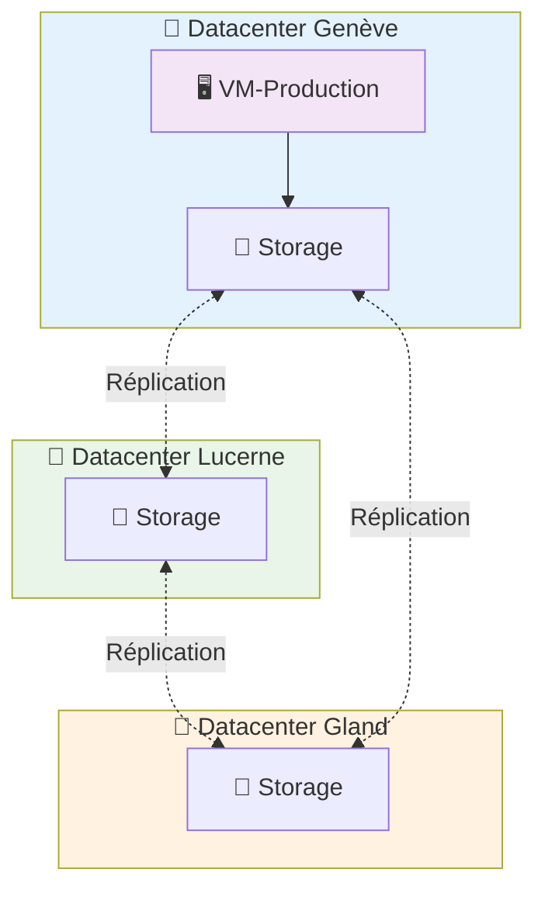

# Machines Virtuelles sur Hikube

Les **Machines Virtuelles (VMs)** d'Hikube offrent une virtualisation complète de l'infrastructure matérielle, garantissant l'exécution de systèmes d'exploitation hétérogènes et d'applications métier dans des environnements cloisonnés et conformes aux exigences de sécurité d'entreprise.

---

## 🏗️ Architecture et Fonctionnement

### **Séparation Compute et Stockage**

Hikube utilise une architecture **découplée** entre le calcul et le stockage qui garantit une résilience optimale :

**💻 Couche Compute**

- La VM s'exécute sur des **serveurs physiques** sur un des 3 datacenters
- Si un nœud tombe en panne, la VM est **automatiquement redémarrée** sur un autre nœud
- Si un datacenter tombe en panne, la VM est **automatiquement redémarrée** sur un autre noeud dans un des 2 datacenters restant
- Le temps d'indisponibilité se limite au redémarrage (généralement < 2 minutes)

**💾 Couche Stockage (Persistante)**

- Les disques des VMs sont **répliqués automatiquement** sur plusieurs nœuds physiques avec le stockage "replicated"
- **Aucune perte de données** même en cas de panne matérielle multiple
- Les disques survivent aux pannes et restent attachables à la VM relocalisée

Cette séparation garantit que **vos données sont toujours sûres**, même si le serveur physique hébergeant votre VM devient indisponible où qu'un datacenter devienne indisponible.
Nous garantissons les ressources !

### **Architecture Multi-Datacenter**

---

## ⚙️ Types d'Instances

### **Gamme Complète pour Tous les Besoins**

Hikube propose trois séries d'instances optimisées pour différents profils d'usage, garantissant des performances adaptées à chaque workload :

### **Série S - Standard (Ratio 1:2)**

Instances **orientées calcul** avec un ratio CPU/mémoire de 1:2, idéales pour les charges CPU-intensives.

| **Instance** | **vCPU** | **RAM** | **Cas d'Usage Typiques** |
|--------------|----------|---------|---------------------------|
| `s1.small`   | 1        | 2 GB    | Services légers, proxies |
| `s1.medium`  | 2        | 4 GB    | Workers, batch processing |
| `s1.large`   | 4        | 8 GB    | Calcul scientifique |
| `s1.xlarge`  | 8        | 16 GB   | Rendu, compilation |
| `s1.3large`  | 12       | 24 GB   | Applications intensives |
| `s1.2xlarge` | 16       | 32 GB   | HPC, simulations |
| `s1.3xlarge` | 24       | 48 GB   | Calcul distribué |
| `s1.4xlarge` | 32       | 64 GB   | Calcul massif |
| `s1.8xlarge` | 64       | 128 GB  | Calcul exascale |

### **Série U - Universal (Ratio 1:4)**

Instances **polyvalentes** offrant un équilibre optimal entre CPU et mémoire pour la majorité des applications d'entreprise.

| **Instance** | **vCPU** | **RAM** | **Cas d'Usage Typiques** |
|--------------|----------|---------|---------------------------|
| `u1.medium`  | 1        | 4 GB    | Dev, tests, micro-services |
| `u1.large`   | 2        | 8 GB    | Applications web, APIs |
| `u1.xlarge`  | 4        | 16 GB   | Applications métier |
| `u1.2xlarge` | 8        | 32 GB   | Workloads intensifs |
| `u1.4xlarge` | 16       | 64 GB   | Applications critiques |
| `u1.8xlarge` | 32       | 128 GB  | Applications enterprise |

### **Série M - Memory (Ratio 1:8)**

Instances **haute mémoire** avec un ratio CPU/mémoire de 1:8 pour les applications gourmandes en RAM.

| **Instance** | **vCPU** | **RAM** | **Cas d'Usage Typiques** |
|--------------|----------|---------|---------------------------|
| `m1.large`   | 2        | 16 GB   | Caches Redis, Memcached |
| `m1.xlarge`  | 4        | 32 GB   | Bases de données in-memory |
| `m1.2xlarge` | 8        | 64 GB   | Analytics, Big Data |
| `m1.4xlarge` | 16       | 128 GB  | SAP HANA, Oracle |
| `m1.8xlarge` | 32       | 256 GB  | Data warehouses |

:::tip **Guide de Sélection**

- **Calcul intensif, CI/CD** → Série **S** (ratio 1:2, CPU optimisé)
- **Applications web classiques** → Série **U** (ratio 1:4, équilibrée)  
- **Bases de données, Analytics** → Série **M** (ratio 1:8, mémoire optimisée)
:::

---

## 🔒 Isolation et Sécurité

### **Multi-Tenant par Design**

Chaque VM bénéficie d'une **isolation complète** grâce à une architecture sécurisée qui cloisonne strictement les ressources entre les différents tenants. Cette isolation s'appuie sur plusieurs couches de protection complémentaires :

- **Tenant** : Séparation logique des ressources au niveau applicatif, chaque tenant disposant de son propre espace d'exécution
- **Isolation kernel** : Isolation réseau et processus au niveau du noyau Linux, garantissant qu'aucune VM ne peut accéder aux ressources d'une autre
- **Storage classes** : Chiffrement automatique et isolation des données, avec séparation cryptographique des volumes par tenant

---

## 🌐 Connectivité et Accès

### **Méthodes d'Accès Natives**

L'accès aux machines virtuelles Hikube s'effectue via des mécanismes natifs intégrés à la plateforme, éliminant le besoin d'infrastructure réseau complexe. La **console série** fournit un accès direct de bas niveau indépendant du réseau, idéal pour le debugging et la maintenance système. Pour les environnements graphiques, **VNC** permet une connexion à l'interface utilisateur de la VM via des tunnels sécurisés. L'accès **SSH** traditionnel reste disponible soit via `virtctl ssh` qui gère automatiquement la connectivité, soit directement via l'IP externe assignée. Les services applicatifs peuvent être exposés sélectivement via des **listes de ports contrôlées** qui filtrent intelligemment le trafic sans compromettre la sécurité du tenant.

### **Réseau Défini par Logiciel**

L'architecture réseau d'Hikube repose sur une approche Software-Defined qui virtualise complètement la couche réseau. Chaque VM reçoit automatiquement une **IP privée** dans un segment réseau isolé par tenant, garantissant l'isolation tout en permettant la communication interne. Le système peut optionnellement assigner une **IP publique IPv4** pour l'exposition externe, avec un routage automatique qui maintient la segmentation sécurisée. Le **firewall distribué** applique des politiques de sécurité granulaires directement au niveau de chaque VM, avec des règles restrictives par défaut qui s'adaptent dynamiquement aux besoins de l'application.

---

## 📦 Migration et Portabilité

### **Import de Workloads Existants**

La plateforme Hikube facilite la migration d'infrastructures existantes grâce à des mécanismes d'import universels qui préservent l'intégrité des workloads. Les **images cloud standardisées** (Ubuntu Cloud Images, CentOS Cloud) s'intègrent nativement pour un déploiement immédiat avec les optimisations cloud natives. Pour les installations personnalisées, l'import d'**images ISO** permet de recréer des environnements sur mesure en conservant toutes les configurations spécifiques. Les **snapshots VMware** sont convertis automatiquement du format VMDK vers RAW, assurant une transition transparente depuis les infrastructures de virtualisation traditionnelles. La compatibilité avec les **formats Proxmox et OpenStack** (QCOW2) garantit l'interopérabilité avec la majorité des solutions cloud existantes.

### **Gestion du Cycle de Vie**

Le système de gestion du cycle de vie intègre des mécanismes automatisés qui assurent la continuité opérationnelle des machines virtuelles. Les **snapshots** capturent instantanément l'état complet de la VM, incluant la mémoire et le stockage, pour permettre des retours arrière précis lors de maintenance ou d'incidents. Le **backup automatique** orchestre des sauvegardes programmées des disques avec rétention configurable, répliquées automatiquement sur les trois datacenters pour garantir la récupération en cas de sinistre. La **migration live** déplace les VMs entre nœuds physiques sans interruption de service, facilitant la maintenance matérielle et l'optimisation des charges sans impact sur les applications critiques.

---

## 🚀 Prochaines Étapes

Maintenant que vous comprenez l'architecture des VMs Hikube :

**🏃‍♂️ Démarrage Immédiat**  
→ [Créer votre première VM en 5 minutes](./quick-start.md)

**📖 Configuration Avancée**  
→ [Référence API complète](./api-reference.md)

:::tip Architecture Recommandée
Pour la production, utilisez toujours la classe de stockage `replicated` et dimensionnez vos VMs avec au moins 2 vCPU pour bénéficier de meilleures performances.
:::
