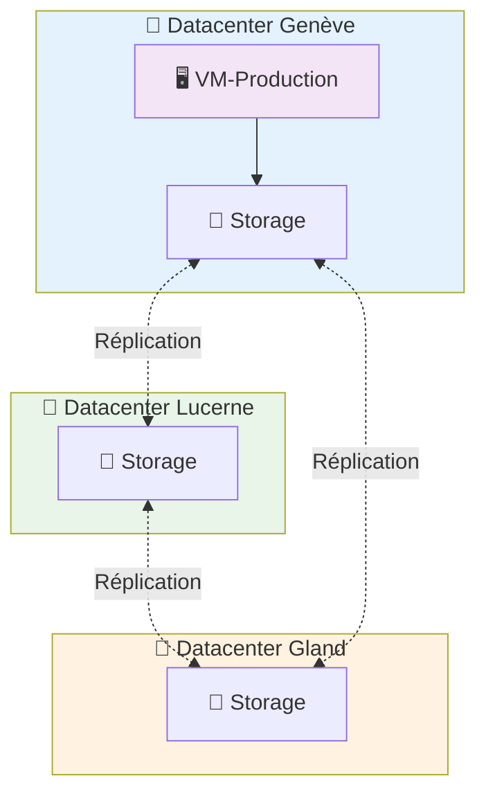

# Machines Virtuelles sur Hikube

Les **Machines Virtuelles (VMs)** d'Hikube offrent une virtualisation complète de l'infrastructure matérielle, garantissant l'exécution de systèmes d'exploitation hétérogènes et d'applications métier dans des environnements cloisonnés et conformes aux exigences de sécurité d'entreprise.

---

## 🏗️ Architecture et Fonctionnement

### **Séparation Compute et Stockage**

Hikube utilise une architecture **découplée** entre le calcul et le stockage qui garantit une résilience optimale :

**💻 Couche Compute (Volatile)**
- Les VMs s'exécutent sur des **serveurs physiques** sur un des 3 datacenters
- Si un nœud tombe en panne, la VM est **automatiquement redémarrée** sur un autre nœud
- Si un datacenter tombe en panne, la VM est **automatiquement redémarrée** sur un autre noeud dans un des 2 datacenters restant.
- Le temps d'indisponibilité se limite au redémarrage (généralement < 2 minutes)

**💾 Couche Stockage (Persistante)**
- Les disques des VMs sont **répliqués automatiquement** sur plusieurs nœuds physiques
- **Aucune perte de données** même en cas de panne matérielle multiple
- Les disques survivent aux pannes et restent attachables à la VM relocalisée

Cette séparation garantit que **vos données sont toujours sûres**, même si le serveur physique hébergeant votre VM devient indisponible où qu'un datacenter devienne indisponible.
Nous garantissons les ressources!

### **Architecture Multi-Datacenter**

---

## 🔒 Isolation et Sécurité

### **Multi-Tenant par Design**

Chaque VM bénéficie d'une **isolation complète** grâce à :

- **Tenant** : Séparation logique des ressources
- **Réseau dédiés** : Isolation réseau au niveau L2/L3
- **Storage classes** : Chiffrement et isolation des données

---

## 🌐 Connectivité et Accès

### **Méthodes d'Accès Natives**

Hikube offre plusieurs moyens d'accéder à vos VMs :

- **Console série** : Accès direct via `virtctl console`
- **VNC** : Interface graphique via `virtctl vnc`  
- **SSH** : Connexion directe via `virtctl ssh` ou IP externe
- **LoadBalancer** : Exposition de services spécifiques

### **Réseau Défini par Logiciel**

Chaque VM dispose de :
- **IP privée** automatique dans le VLAN du tenant
- **IP publique v4** optionnelle 
- **Routage automatique** entre VMs du même tenant
- **Firewall distribué** avec règles par défaut sécurisées

---

## 📦 Migration et Portabilité

### **Import de Workloads Existants**

Hikube supporte l'import depuis :
- **Images cloud** (Ubuntu Cloud Images, CentOS Cloud, etc.)
- **Images ISO** pour installations complètes
- **Snapshots VMware** (via conversion VMDK → RAW)
- **Images Proxmox/OpenStack** (format QCOW2)

### **Gestion du Cycle de Vie**

- **Snapshots** : Sauvegarde instantanée de l'état VM
- **Backup automatique** : Sauvegarde programmée des disques
- **Migration live** : Déplacement sans interruption entre nœuds

---

## 🚀 Prochaines Étapes

Maintenant que vous comprenez l'architecture des VMs Hikube :

**🏃‍♂️ Démarrage Immédiat**  
→ [Créer votre première VM en 5 minutes](./quick-start.md)

**📖 Configuration Avancée**  
→ [Référence API complète](./api-reference.md)

:::tip Architecture Recommandée
Pour la production, utilisez toujours la classe de stockage `replicated` et dimensionnez vos VMs avec au moins 2 vCPU pour bénéficier de meilleures performances réseau.
:::