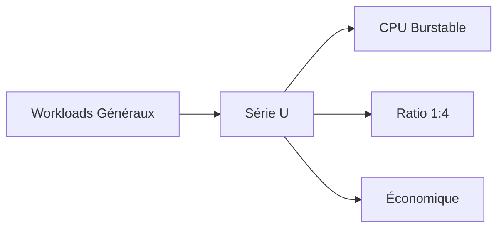

# Machines Virtuelles Hikube

Les **Machines Virtuelles (VMs)** d'Hikube simulent du matériel informatique complet, permettant à divers systèmes d'exploitation et applications de s'exécuter dans un environnement isolé et sécurisé.
---

## 🚀 Avantages Clés

### **Isolation et Sécurité**
- **Environnements isolés** pour chaque application
- **Sécurité renforcée** avec isolation complète au niveau hardware
- **Multi-tenancy** native avec séparation des ressources

### **Flexibilité et Performance**
- **Support multi-OS** : Linux, Windows, BSD
- **Types d'instances optimisés** selon vos besoins
- **Scaling automatique** et redimensionnement à chaud
- **GPU passthrough** pour workloads intensifs

### **Intégration Kubernetes**
- **API Kubernetes native** pour la gestion
- **Networking intégré** avec les services K8s
- **Stockage persistant** avec PVC
- **Monitoring unifié** avec Prometheus

---

## 📊 Types d'Instances Disponibles

Hikube propose plusieurs séries d'instances optimisées pour différents cas d'usage :

### **🌐 Série U (Universal)**
*Usage général avec performance CPU partagée*



**Caractéristiques :**
- ⚡ **Performance CPU burstable** - Baseline avec burst possible
- 🔄 **Partage de CPU** optimisé par time-slicing
- 💰 **Rapport qualité/prix** excellent
- 📈 **Ratio vCPU:Memory** de 1:4

### **🧮 Série CX (Compute Optimized)**
*Optimisée pour calcul intensif avec CPU dédié*

**Caractéristiques :**
- 🎯 **CPU dédié** - Cœurs physiques exclusifs
- ⚡ **Performance garantie** sans partage
- 🔧 **Threads émulateur isolés** pour réduire l'impact
- 🧠 **vNUMA** - Topologie NUMA optimisée
- 📊 **Ratio vCPU:Memory** de 1:2

### **💾 Série M (Memory Optimized)**
*Optimisée pour applications nécessitant beaucoup de mémoire*

**Caractéristiques :**
- 🚀 **Hugepages** pour performance mémoire optimale
- ⚡ **CPU burstable** avec baseline garanti
- 📊 **Ratio vCPU:Memory** de 1:8
- 🧠 **Idéal** pour bases de données, cache, analytics

### **⏱️ Série RT (Real-Time)**
*Pour applications temps réel critiques*

**Caractéristiques :**
- 🎯 **CPU dédié** avec isolation complète
- 🚀 **Hugepages** pour latence minimale
- ⚡ **Threads émulateur isolés**
- 🕐 **Garanties temps réel** strictes
- 📊 **Ratio vCPU:Memory** de 1:4

---

## 🖥️ Profils d'OS Supportés

Hikube supporte une large gamme de systèmes d'exploitation :

### **🐧 Distributions Linux**
- **Ubuntu** (Cloud images)
- **CentOS Stream** (8, 9, 10)
- **Red Hat Enterprise Linux** (7, 8, 9, 10)
- **Fedora** (amd64, arm64)
- **openSUSE** (Leap, Tumbleweed)
- **Alpine Linux**
- **SUSE Linux Enterprise Server**

### **🪟 Microsoft Windows**
- **Windows 10** / **Windows 11**
- **Windows Server** (2016, 2019, 2022, 2025)
- **Support VirtIO** pour performance optimale

### **🔬 Distributions Spécialisées**
- **Cirros** (tests et développement)
- **Talos Linux** (Kubernetes-optimized)

---

## 💾 Gestion du Stockage

### **VM Disks Flexibles**
- **Images source** : HTTP, registries, snapshots
- **Disques optiques** pour ISO et médias
- **Classes de stockage** : replicated, local, NFS
- **Redimensionnement dynamique** sans interruption

### **Types de Stockage**
```yaml
# Stockage répliqué haute disponibilité
storageClass: "replicated"

# Stockage local haute performance
storageClass: "local"

# Stockage réseau NFS
storageClass: "nfs"
```

---

## 🌐 Accès et Connectivité

### **Méthodes d'Accès**
- **Console série** : `virtctl console <vm>`
- **Interface VNC** : `virtctl vnc <vm>`
- **SSH direct** : `virtctl ssh user@<vm>`
- **Accès externe** : LoadBalancer et NodePort

### **Networking**
- **Réseaux isolés** par tenant
- **Routeurs virtuels** pour interconnexion
- **VPN** pour accès sécurisé
- **Load balancing** automatique

---

## 🔧 Cas d'Usage Typiques

### **🏢 Infrastructure d'Entreprise**
- **Applications legacy** nécessitant un OS spécifique
- **Bases de données** haute performance
- **Services Windows** intégrés

### **🔬 Développement et Test**
- **Environnements de développement** isolés
- **Tests multi-OS** automatisés
- **CI/CD pipelines** avec VMs éphémères

### **📊 Analytics et AI/ML**
- **Traitement de données** avec ressources dédiées
- **Workloads GPU** pour machine learning
- **Calcul scientifique** haute performance

---

## 🎯 Prochaines Étapes

<div style={{display: 'flex', gap: '20px', flexWrap: 'wrap'}}>

**🚀 Démarrage Rapide**  
→ [Créer votre première VM](./quick-start.md)

**📚 Référence API**  
→ [Configuration avancée](./api-reference.md)

</div>

---

:::tip Performance Optimale
Pour des workloads critiques, utilisez les séries **CX** ou **RT** avec du stockage **replicated** pour garantir performance et haute disponibilité.
:::

:::info Assistance
Les machines virtuelles Hikube sont basées sur [KubeVirt](https://kubevirt.io/), bénéficiant de tout l'écosystème et des bonnes pratiques de cette technologie éprouvée.
::: 