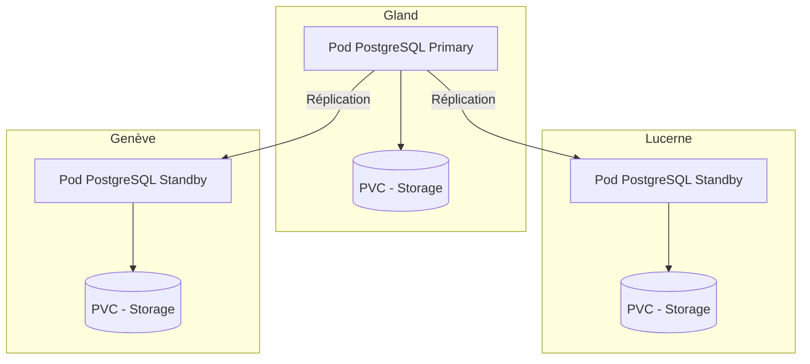

# PostgreSQL sur Hikube

Hikube propose un service PostgreSQL managé, basé sur l’opérateur **CloudNativePG**, reconnu et largement adopté par la communauté.  
La plateforme prend en charge le déploiement et la gestion d’un cluster PostgreSQL **répliqué et auto-réparant**, garantissant robustesse, performance et haute disponibilité sans effort côté utilisateur.

---

## 🏗️ Architecture et Fonctionnement

Le service PostgreSQL managé sur Hikube repose sur l’opérateur **CloudNativePG**, qui automatise la gestion complète du cycle de vie de la base de données : création, mise à jour, réplication et reprise après incident.  

L’architecture est construite autour d’un **cluster répliqué** :  

- Un **nœud primaire** (primary) qui traite les écritures et sert de référence pour la cohérence des données.  
- Un ou plusieurs **réplicas** (standby) qui reçoivent en temps réel les modifications grâce à la réplication synchrone ou asynchrone.  
- Un mécanisme d’**auto-failover**, qui permet de promouvoir automatiquement un réplica en tant que nouveau primaire en cas de panne, assurant ainsi une **haute disponibilité** sans intervention manuelle.  

Cette approche garantit :  

- **Résilience** face aux pannes matérielles ou logicielles  
- **Scalabilité en lecture** grâce à la répartition des requêtes entre les réplicas  
- **Simplicité opérationnelle**, car la plateforme gère la coordination et la maintenance du cluster  

---

## 💡 Cas d’usage

- **Applications métiers critiques** nécessitant une base fiable et hautement disponible  
- **E-commerce et ERP**, où la continuité de service est indispensable  
- **SaaS multi-tenant**, permettant de répartir les charges entre primaire et réplicas  
- **Business Intelligence et reporting**, grâce à la lecture optimisée sur les réplicas  
- **Applications cloud natives**, intégrées dans des environnements Kubernetes  
