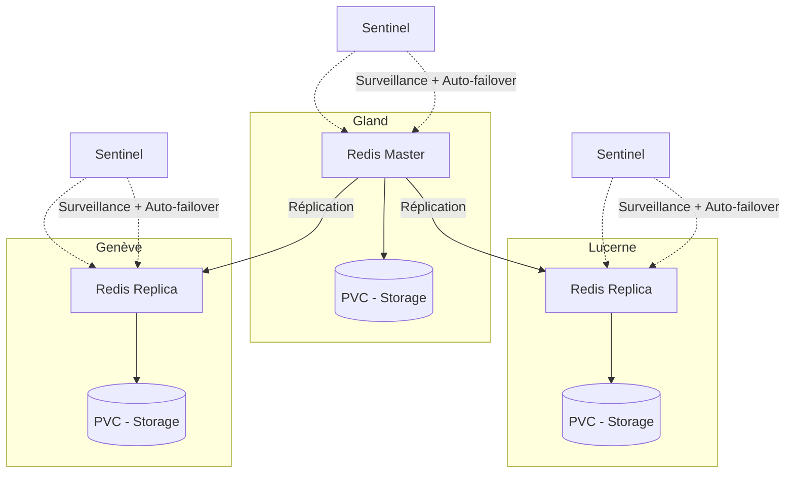

# Redis sur Hikube

Hikube propose un service **Redis managé**, basé sur l’opérateur **[Spotahome Redis Operator](https://github.com/spotahome/redis-operator)**, largement utilisé dans la communauté.  
La plateforme prend en charge le déploiement et la gestion d’un cluster Redis **répliqué et auto-réparant**, s’appuyant sur **Redis Sentinel** pour assurer la détection des pannes et l’auto-failover.  
Ce service garantit rapidité, faible latence et haute disponibilité, sans effort côté utilisateur.  

---

## Structure de Base

### **Ressource Redis**

#### Exemple de configuration YAML

```yaml
apiVersion: apps.cozystack.io/v1alpha1
kind: Redis
metadata:
  name: example
  namespace: default
spec:
```

---

## 🏗️ Architecture et Fonctionnement

Le service Redis managé sur Hikube est conçu pour offrir **haute disponibilité** et **résilience** grâce à une architecture répliquée.  

- Un **nœud master** gère toutes les écritures et sert de source de vérité pour les données.  
- Un ou plusieurs **nœuds replicas** reçoivent les données en réplication pour assurer la scalabilité en lecture.  
- **Redis Sentinel** surveille en permanence l’état du cluster, détecte les pannes et peut promouvoir automatiquement un replica en nouveau master (**auto-failover**).  

Cette combinaison garantit :  

- **Disponibilité continue** même en cas de panne du master  
- **Performances élevées** avec la répartition des lectures entre replicas  
- **Simplicité opérationnelle**, la gestion étant automatisée par la plateforme et l’opérateur Spotahome  



## 🎯 Cas d’usage

Le service **Redis managé sur Hikube** est particulièrement adapté pour :  

- **Cache applicatif** : accélérer les applications web (e-commerce, SaaS, API) en réduisant le temps de réponse grâce au stockage en mémoire.  
- **Sessions distribuées** : gérer les sessions utilisateurs de manière rapide et fiable dans des environnements multi-instances.  
- **File d’attente et streaming léger** : utilisation de Redis comme message broker (pub/sub, queues) pour des communications temps réel.  
- **Analytics temps réel** : traitement rapide de métriques, logs ou évènements en streaming.  
- **Gaming et IoT** : gestion d’états temporaires, classements et données volatiles avec faible latence.  
