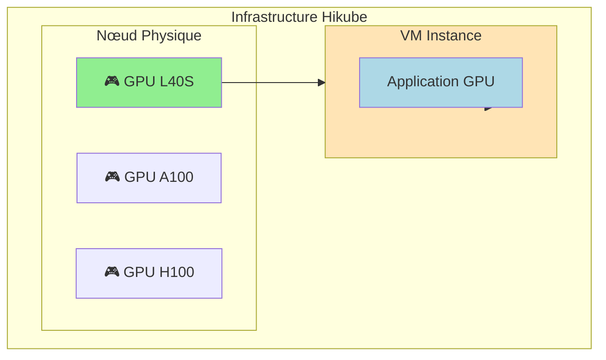
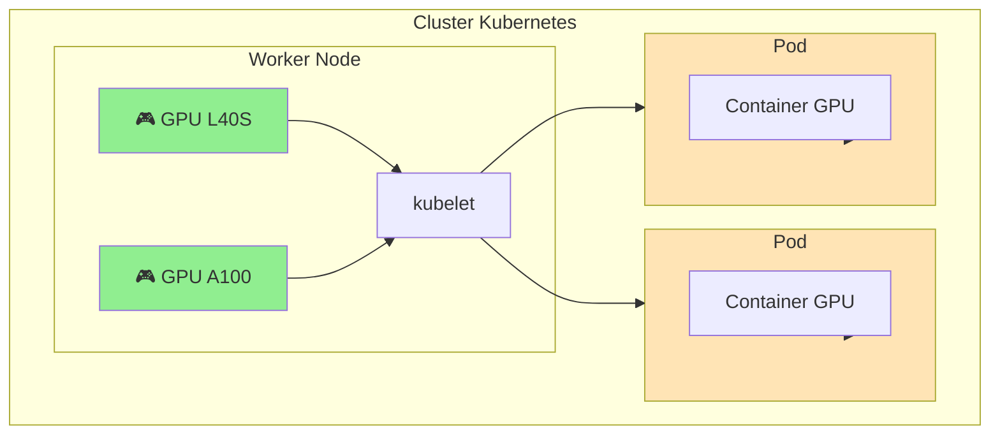

# GPUs sur Hikube

Hikube propose l'accès aux accélérateurs **NVIDIA** via GPU Passthrough, permettant l'exécution de workloads nécessitant une accélération matérielle. Les GPU sont disponibles pour deux types de workloads : machines virtuelles et pods Kubernetes.

---

## 🎯 Types d'Utilisation

### **GPU avec Machines Virtuelles**
Les GPU peuvent être attachés directement aux machines virtuelles via GPU passthrough VFIO-PCI, offrant un accès complet et exclusif à l'accélérateur.

**Cas d'usage :**
- Applications nécessitant un contrôle complet du GPU
- Workloads legacy ou spécialisés
- Environnements de développement isolés
- Applications graphiques (rendu, CAO)

### **GPU avec Kubernetes**
Les GPU peuvent être alloués aux workers Kubernetes et ensuite assignés aux pods via les resource requests/limits.

**Cas d'usage :**
- Workloads containerisés d'IA/ML
- Scaling automatique des applications GPU
- Partage de ressources GPU entre applications
- Orchestration complexe de jobs parallèles

---

## 🖥️ Hardware Disponible

Hikube propose trois types de GPU NVIDIA :

### **NVIDIA L40S**
- **Architecture** : Ada Lovelace
- **Mémoire** : 48 GB GDDR6 avec ECC
- **Performance** : 362 TOPS (INT8), 91.6 TFLOPs (FP32)
- **Usage typique** : IA générative, inférence, rendu temps réel

### **NVIDIA A100**
- **Architecture** : Ampere
- **Mémoire** : 80 GB HBM2e avec ECC
- **Performance** : 312 TOPS (INT8), 624 TFLOPs (Tensor)
- **Usage typique** : Entraînement ML, calcul haute performance

### **NVIDIA H100**
- **Architecture** : Hopper
- **Mémoire** : 80 GB HBM3 avec ECC
- **Performance** : 1979 TOPS (INT8), 989 TFLOPs (Tensor)
- **Usage typique** : LLM, transformers, calcul exascale

---

## 🏗️ Architecture

### **Allocation GPU avec VMs**



### **Allocation GPU avec Kubernetes**



---

## ⚙️ Configuration

### **GPU sur VM**
```yaml
apiVersion: apps.cozystack.io/v1alpha1
kind: VirtualMachine
spec:
  instanceType: "u1.xlarge"
  gpus:
    - name: "nvidia.com/AD102GL_L40S"
```

### **GPU sur Kubernetes Worker**
```yaml
apiVersion: apps.cozystack.io/v1alpha1
kind: Kubernetes
spec:
  nodeGroups:
    gpu-workers:
      instanceType: "u1.xlarge"
      gpus:
        - name: "nvidia.com/AD102GL_L40S"
```

### **GPU dans Pod Kubernetes**
```yaml
apiVersion: v1
kind: Pod
spec:
  containers:
  - name: gpu-app
    image: nvidia/cuda:12.0-runtime-ubuntu20.04
    resources:
      limits:
        nvidia.com/gpu: 1
```

---

## 📋 Comparaison des Approches

| **Aspect** | **GPU sur VM** | **GPU sur Kubernetes** |
|------------|----------------|------------------------|
| **Isolation** | Complète (1 GPU = 1 VM) | Partagée (orchestrée) |
| **Performance** | Native (passthrough) | Native (device plugin) |
| **Gestion** | Manuelle | Automatisée |
| **Scaling** | Vertical uniquement | Horizontal + Vertical |
| **Partage** | Non | Oui (entre pods) |
| **Complexité** | Simple | Complexe |

---

## 🚀 Prochaines Étapes

### **Pour les Machines Virtuelles**
- [Créer une VM GPU](./quick-start.md) → Guide pratique
- [API Reference](./api-reference.md) → Configuration complète

### **Pour Kubernetes**
- [Clusters GPU](../kubernetes/overview.md) → Workers avec GPU
  - [Configuration avancée](../kubernetes/api-reference.md) → NodeGroups GPU
 