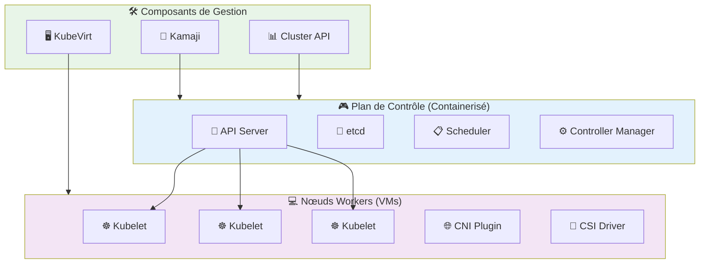

# ☸️ Kubernetes Managé sur Hikube

Les **clusters Kubernetes managés** d'Hikube offrent une solution d'orchestration de conteneurs entièrement gérée, éliminant la complexité opérationnelle tout en garantissant une scalabilité, une sécurité et une performance de niveau entreprise.

---

## 🚀 Pourquoi Kubernetes sur Hikube ?

### **🎯 Simplicité Opérationnelle**
- **Déploiement en quelques clics** : Cluster prêt en 5 minutes
- **Gestion automatisée** : Mises à jour, sauvegardes et scaling transparents
- **API native Kubernetes** : Compatibilité totale avec l'écosystème

### **🔧 Infrastructure Optimisée**
- **Machines virtuelles dédiées** : Nœuds workers isolés et sécurisés
- **Plan de contrôle containerisé** : Efficacité et résilience maximales
- **Storage haute performance** : Volumes persistants avec classes de stockage adaptées

### **📈 Scalabilité Intelligente**
- **Auto-scaling automatique** : Ajustement dynamique selon la charge
- **Multi-node groups** : Types d'instances spécialisées (CPU, GPU, mémoire)
- **Évolutivité horizontale** : De 1 à des centaines de nœuds

---

## 🏗️ Architecture Technique

### **Stack Technologique**

Hikube déploie Kubernetes en utilisant des composants éprouvés de l'écosystème CNCF :

### **Composants Clés**

#### **🎯 Kamaji - Plan de Contrôle**
- **Control Plane containerisé** : API Server, etcd, Scheduler en conteneurs
- **Multi-tenant natif** : Isolation parfaite entre clusters
- **Haute disponibilité** : Réplication automatique des composants critiques

#### **📊 Cluster API - Gestion des Clusters** 
- **Lifecycle management** : Création, mise à jour, suppression des clusters
- **Infrastructure as Code** : Gestion déclarative via YAML
- **Standardisation** : API unifiée pour tous types de déploiements

#### **🖥️ KubeVirt - Infrastructure Workers**
- **Nœuds workers en VMs** : Isolation et sécurité maximales
- **Gestion automatisée** : Provisioning, mise à l'échelle, maintenance
- **Intégration native** : Support des volumes et réseaux Hikube

---

## 💡 Cas d'Usage

### **🚀 Applications Cloud-Native**
- **Microservices** : Orchestration d'architectures distribuées
- **CI/CD pipelines** : Environnements de build et déploiement
- **API backends** : Services web scalables et résilients

### **📊 Workloads Spécialisés**
- **Machine Learning** : Clusters avec nœuds GPU pour l'IA
- **Bases de données** : PostgreSQL, Redis, MongoDB en mode operator
- **Big Data** : Apache Spark, Kafka pour le traitement de données

### **🔧 Environnements de Développement**
- **Dev/Test/Staging** : Environnements éphémères et reproductibles  
- **Feature branches** : Clusters dédiés par fonctionnalité
- **Formation** : Environnements d'apprentissage isolés

---

## 🎛️ Fonctionnalités Avancées

### **🌐 Services LoadBalancer**
- **Exposition externe automatique** : Services accessibles depuis Internet
- **Load balancing intelligent** : Distribution optimale du trafic
- **SSL/TLS natif** : Certificats automatiques avec Let's Encrypt

### **💾 Stockage Persistant**
- **Classes de stockage multiples** : `local`, `replicated`, `fast-ssd`
- **Volumes dynamiques** : Provisioning automatique selon les besoins
- **Snapshots et sauvegardes** : Protection des données critiques

### **🔐 Sécurité Intégrée**
- **RBAC granulaire** : Contrôle d'accès fin par namespace
- **Network Policies** : Micro-segmentation du trafic réseau
- **Pod Security Standards** : Conformité sécuritaire automatique

### **📈 Observabilité Native**
- **Métriques Prometheus** : Monitoring complet des clusters
- **Logs centralisés** : Collecte et analyse des journaux
- **Dashboards Grafana** : Visualisation temps réel des performances

---

## 🚦 Add-ons Disponibles

### **🔒 Cert-Manager**
Gestion automatisée des certificats SSL/TLS avec Let's Encrypt et autres CA.

### **🌐 Ingress NGINX**
Contrôleur d'ingress haute performance pour l'exposition des services HTTP/HTTPS.

### **📦 Flux CD**
Déploiement GitOps pour une approche "infrastructure as code" complète.

### **📊 Agents de Monitoring**
Intégration avec FluentBit pour la collecte centralisée des logs et métriques.

---

## 🎯 Avantages Hikube

### **⚡ Performance Optimisée**
- **SSD NVMe** : Stockage haute performance pour etcd et volumes
- **Réseau dédié** : Bande passante garantie entre nœuds
- **CPU/RAM dédiés** : Ressources garanties sans overselling

### **🛡️ Sécurité Enterprise**
- **Isolation complète** : Chaque cluster dans son propre tenant
- **Chiffrement transparent** : Données chiffrées au repos et en transit
- **Auditing complet** : Traçabilité de toutes les actions

### **💰 Optimisation des Coûts**
- **Scaling intelligent** : Ressources ajustées à la demande réelle
- **Facturation granulaire** : Paiement uniquement des ressources utilisées
- **Environnements éphémères** : Coûts optimisés pour dev/test

---

## 📚 Prochaines Étapes

### **🚀 Démarrage Rapide**
- **[Créer votre premier cluster](./quick-start.md)** → Déploiement en 5 minutes
- **[Configuration avancée](./api-reference.md)** → Paramétrage complet

### **📖 Ressources Complémentaires**
- **[Documentation Kubernetes](https://kubernetes.io/)** → Guide officiel
- **[Cluster API](https://cluster-api.sigs.k8s.io/)** → Gestion des clusters
- **[KubeVirt](https://kubevirt.io/)** → Virtualisation dans Kubernetes

:::success Kubernetes Prêt ! 🎉
Avec Kubernetes sur Hikube, vous disposez d'une plateforme d'orchestration moderne, sécurisée et entièrement managée pour vos applications cloud-native.
:::

---

**Recommandation :** Commencez par le [guide de démarrage rapide](./quick-start.md) pour créer votre premier cluster Kubernetes et découvrir la puissance d'Hikube. 