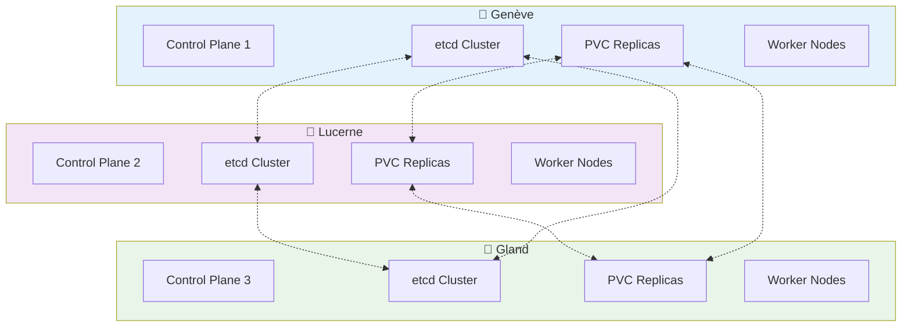

# Kubernetes Managé sur Hikube

Hikube propose des clusters Kubernetes managés où le plan de contrôle est géré par la plateforme et les nœuds workers sont des machines virtuelles dans votre tenant.

---

## 🏗️ Architecture

### **Composants**

- **Plan de contrôle** : Géré par Hikube (API Server, etcd, Scheduler, Controller Manager)
- **Nœuds workers** : Machines virtuelles dans votre tenant
- **Stockage** : Volumes persistants avec classes de stockage `local` et `replicated`
- **Réseau** : CNI avec support LoadBalancer et Ingress

### **Multi-Datacenter**

Les clusters Hikube sont déployés sur 3 datacenters suisses avec réplication automatique :



---

## ⚙️ Fonctionnalités

### **Node Groups**
- **Types d'instances flexibles** : S1 (standard), U1 (universal), M1 (memory-optimized)
- **Scaling automatique** : `minReplicas` et `maxReplicas` configurables
- **Support GPU** : Attachment de GPU NVIDIA aux workers
- **Roles spécialisés** : `ingress-nginx`, `monitoring`, etc.

### **Stockage Persistant**
- **Classes disponibles** : `local` (nœud unique), `replicated` (3 datacenters)
- **Provisioning dynamique** : Création automatique des volumes
- **Réplication multi-datacenter** : PVC répliqués sur les 3 sites

### **Réseau et Exposition**
- **Services LoadBalancer** : Exposition externe automatique via IP dédiée
- **Ingress Controller** : NGINX intégré avec certificats automatiques
- **Network Policies** : Micro-segmentation du trafic

---

## 🔧 Add-ons Disponibles

### **Cert-Manager**
- Gestion automatisée des certificats SSL/TLS
- Support Let's Encrypt et autres CA
- Renouvellement automatique

### **Ingress NGINX**
- Contrôleur d'ingress haute performance
- Support wildcard et SNI
- Métriques Prometheus intégrées

### **Flux CD**
- Déploiement GitOps
- Synchronisation avec dépôts Git
- Rollback automatique

### **Monitoring Agents**
- FluentBit pour les logs
- Node Exporter pour les métriques
- Intégration avec stack monitoring du tenant

---

## 📋 Cas d'Usage

### **Applications Web**
```yaml
nodeGroups:
  web:
    minReplicas: 2
    maxReplicas: 10
    instanceType: "s1.large"
    roles: ["ingress-nginx"]
```

### **Workloads ML/AI**
```yaml
nodeGroups:
  ml:
    minReplicas: 1
    maxReplicas: 5
    instanceType: "u1.xlarge"
    gpus:
      - name: "nvidia.com/L40S"
```

### **Applications Critiques**
```yaml
nodeGroups:
  production:
    minReplicas: 3
    maxReplicas: 20
    instanceType: "m1.large"
    storageClass: "replicated"
```

---

## 🚀 Prochaines Étapes

- **[Démarrage rapide](./quick-start.md)** → Créer votre premier cluster
- **[API Reference](./api-reference.md)** → Configuration complète des clusters
- **[GPU](../gpu/overview.md)** → Utiliser des GPU avec Kubernetes

---

## 💡 Points Clés

- **Plan de contrôle managé** : Pas de maintenance des masters
- **Workers dans votre tenant** : Contrôle complet des nœuds
- **Scaling automatique** : Ajustement selon la demande
- **Multi-datacenter** : Haute disponibilité native
- **API Kubernetes standard** : Compatibilité complète 