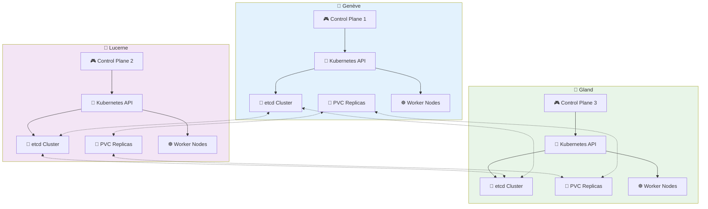

# ☸️ Kubernetes Managé sur Hikube

Les **clusters Kubernetes managés** d'Hikube offrent une solution d'orchestration de conteneurs entièrement gérée, éliminant la complexité opérationnelle tout en garantissant une scalabilité, une sécurité et une performance de niveau entreprise.

---

## 🚀 Pourquoi Kubernetes sur Hikube ?

### **🎯 Simplicité Opérationnelle**
- **Déploiement rapide** : Cluster prêt en moins de 5 minutes
- **Gestion automatisée** : Mises à jour, sauvegardes et scaling transparents
- **API native Kubernetes** : Compatibilité totale avec l'écosystème

### **🔧 Infrastructure Optimisée**
- **Machines virtuelles dédiées** : Nœuds workers isolés et sécurisés
- **Plan de contrôle containerisé** : Efficacité et résilience maximales
- **Storage haute performance** : Volumes persistants avec classes de stockage adaptées

### **📈 Scalabilité Intelligente**
- **Auto-scaling automatique** : Ajustement dynamique selon la charge
- **Multi-node groups** : Types d'instances spécialisées (CPU, GPU, mémoire)
- **Évolutivité horizontale** : De 1 à des centaines de nœuds

---

## 🏗️ Architecture Technique

### **Architecture Multi-Datacenter**

Hikube déploie Kubernetes avec une architecture distribuée sur 3 datacenters pour garantir haute disponibilité et résilience :

### **Composants Clés**

#### **🎯 Plan de Contrôle**
- **Control Plane containerisé** : API Server, etcd, Scheduler en conteneurs
- **Multi-tenant natif** : Isolation parfaite entre clusters
- **Haute disponibilité** : Control Planes distribués sur 3 datacenters avec réplication automatique

#### **📊 Cluster API - Gestion des Clusters** 
- **Lifecycle management** : Création, mise à jour, suppression des clusters
- **Infrastructure as Code** : Gestion déclarative via YAML
- **Standardisation** : API unifiée pour tous types de déploiements

#### **🖥️ Infrastructure Workers**
- **Nœuds workers en VMs** : Isolation et sécurité maximales
- **Gestion automatisée** : Provisioning, mise à l'échelle, maintenance
- **Intégration native** : Support des volumes et réseaux Hikube

### **🌍 Résilience Multi-Datacenter**

#### **📍 Distribution Géographique**
- **3 Datacenters suisses** : Genève, Lucerne, Gland
- **Latence optimisée** : Moins de 5ms entre datacenters
- **Redondance géographique** : Protection contre les pannes régionales

#### **💾 Réplication des Volumes**
- **PVC répliqués en temps réel** : Synchronisation automatique entre les 3 sites
- **Basculement transparent** : Récupération instantanée en cas de panne
- **Cohérence des données** : Garantie de consistance entre réplicas
- **Classes de stockage répliquées** : `replicated` avec facteur de réplication 3

---

## 🎛️ Fonctionnalités Avancées

### **🌐 Services LoadBalancer**
- **Exposition externe automatique** : Services accessibles depuis Internet
- **Load balancing intelligent** : Distribution optimale du trafic
- **SSL/TLS natif** : Certificats automatiques avec Let's Encrypt

### **💾 Stockage Persistant**
- **Classes de stockage multiples** : `local`, `replicated`
- **Volumes dynamiques** : Provisioning automatique selon les besoins
- **Réplication multi-datacenter** : PVC répliqués automatiquement sur les 3 datacenters
- **Haute disponibilité** : Continuité de service garantie même en cas de panne d'un datacenter
- **Snapshots et sauvegardes** : Protection des données critiques avec réplication géographique

### **🔐 Sécurité Intégrée**
- **RBAC granulaire** : Contrôle d'accès fin par namespace
- **Network Policies** : Micro-segmentation du trafic réseau
- **Pod Security Standards** : Conformité sécuritaire automatique

---

## 🚦 Add-ons Disponibles

### **🔒 Cert-Manager**
Gestion automatisée des certificats SSL/TLS avec Let's Encrypt et autres CA.

### **🌐 Ingress NGINX**
Contrôleur d'ingress haute performance pour l'exposition des services HTTP/HTTPS.

### **📦 Flux CD**
Déploiement GitOps pour une approche "infrastructure as code" complète.

### **📊 Agents de Monitoring**
Intégration avec FluentBit pour la collecte centralisée des logs et métriques.

---

## 📚 Prochaines Étapes

### **🚀 Démarrage Rapide**
- **[Créer votre premier cluster](./quick-start.md)** → Déploiement en 5 minutes
- **[Configuration avancée](./api-reference.md)** → Paramétrage complet

### **📖 Ressources Complémentaires**
- **[Documentation Kubernetes](https://kubernetes.io/)** → Guide officiel
- **[Cluster API](https://cluster-api.sigs.k8s.io/)** → Gestion des clusters
- **[KubeVirt](https://kubevirt.io/)** → Virtualisation dans Kubernetes

:::success Kubernetes Prêt ! 🎉
Avec Kubernetes sur Hikube, vous disposez d'une plateforme d'orchestration moderne, sécurisée et entièrement managée pour vos applications cloud-native.
:::

---

**Recommandation :** Commencez par le [guide de démarrage rapide](./quick-start.md) pour créer votre premier cluster Kubernetes et découvrir la puissance d'Hikube. 