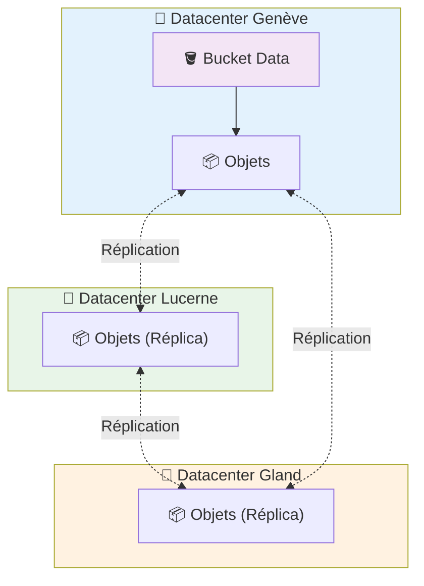

# Buckets S3 sur Hikube

Les **Buckets S3** d’Hikube offrent une solution de stockage objet **hautement disponible**, **répliquée** et **compatible S3** pour vos applications cloud-native, backups, artefacts CI/CD ou données analytiques.  
La plateforme fournit une alternative souveraine et performante à Amazon S3, avec une intégration native à Kubernetes.

---

## 🏗️ Architecture et Fonctionnement

### **Stockage Objet Distribué**

Les buckets Hikube reposent sur une architecture S3 **100 % distribuée et répliquée** sur plusieurs datacenters.  
Contrairement aux volumes block utilisés pour les VMs, le stockage objet n’est pas attaché à une machine : il est accessible via des **APIs S3 standardisées** depuis n’importe quelle application ou service autorisé.

**📦 Couche Stockage**

- Chaque bucket est hébergé sur une **infrastructure multi-nœuds** répartie entre plusieurs datacenters suisses  
- Les objets sont **répliqués automatiquement** sur 3 zones physiques distinctes pour garantir une durabilité maximale  
- Le système est conçu pour tolérer la panne d’un datacenter complet sans perte de données ni indisponibilité

**🌐 Couche Accès**

- Les buckets sont accessibles via un **endpoint HTTPS unique** compatible avec la signature S3 v4  
- L’accès est authentifié par des **Access Keys S3** générées automatiquement lors de la création du bucket  
- Chaque bucket est isolé dans son tenant Kubernetes et dispose de ses propres credentials

---

### **Architecture Multi-Datacenter**



Cette architecture garantit la **disponibilité et la durabilité** des données, tout en restant entièrement opérée en Suisse 🇨🇭.

---

## ⚙️ Cas d’Usage Typiques

Les buckets Hikube sont conçus pour couvrir un large éventail de scénarios de stockage cloud :

| **Cas d'Usage**                 | **Description**                                                   |
| ------------------------------- | ----------------------------------------------------------------- |
| **Backups**                     | Sauvegardes automatisées d'applications ou de volumes persistants |
| **Artefacts CI/CD**             | Stockage d'images, binaires et pipelines GitOps                   |
| **Contenu statique**            | Hébergement de fichiers publics (assets web, PDF, images)         |
| **Données analytiques**         | Centralisation de fichiers CSV/Parquet/JSON pour ETL et outils BI |
| **Logs et archives**            | Stockage longue durée des journaux applicatifs et d'audit         |
| **Snapshots et exports VM**     | Stockage de snapshots KubeVirt, exports RAW ou QCOW2              |
| **Applications S3-compatibles** | Utilisation directe par des apps tierces via SDK ou AWS CLI       |

---

## 🔒 Isolation et Sécurité

### **Séparation par Tenant**

Chaque bucket est **provisionné dans un namespace Kubernetes spécifique**, garantissant un cloisonnement strict :

- Les credentials sont uniques par bucket et stockés dans un Secret Kubernetes généré automatiquement
- Aucune donnée ni clé d'accès n'est partagée entre tenants

### **Chiffrement et Accès Sécurisé**

- Tous les accès passent par **HTTPS/TLS** avec authentification par clé S3
- L’endpoint ne permet pas d’accès anonyme : une clé valide est toujours requise

---

## 🌐 Connectivité et Intégration

### **Endpoint S3 Unique**

Tous les buckets sont accessibles via l’endpoint unique :

```url
https://prod.s3.hikube.cloud
```

### **Compatibilité Totale**

Hikube est compatible avec les outils et SDK AWS S3 standards :

- **AWS CLI** : `aws s3 --endpoint-url https://prod.s3.hikube.cloud ...`
- **MinIO Client (`mc`)** : configuration simple d’un alias avec Access Key / Secret Key
- **Rclone / S3cmd / Velero / Restic** : support natif via la signature v4

Cela permet une intégration fluide dans les pipelines CI/CD, les outils de sauvegarde et les applications analytiques existantes, sans adaptation spécifique.

---

## 📦 Gestion et Portabilité

### **Cycle de Vie Simple**

- La création et la suppression des buckets se font via un simple manifeste Kubernetes
- Les credentials sont automatiquement générés et stockés dans un Secret au format JSON (`BucketInfo`)
- Aucune configuration manuelle n’est requise

### **Interopérabilité Standard**

Grâce à la compatibilité S3, vos données restent **interopérables** avec :

- Des outils cloud existants (AWS CLI, MinIO, Velero…)
- Des pipelines de migration S3 standard (rclone sync, s3cmd mirror…)
- Des services d’analyse externes (Spark, DuckDB, etc.)

---

## 🚀 Prochaines Étapes

Maintenant que vous comprenez l’architecture des Buckets Hikube :

**🏃‍♂️ Démarrage Immédiat**
→ [Créer votre premier bucket](./quick-start.md)

**📖 Configuration Avancée**
→ [Référence API complète](./api-reference.md)

:::tip Recommandation Production
Utilisez un bucket dédié par application ou environnement.
:::
